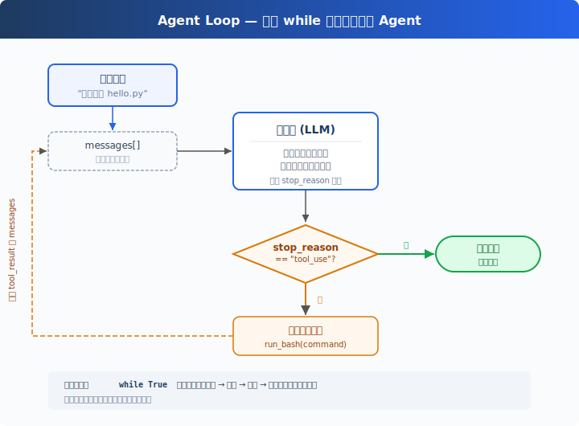

# s02: Agent Loop -- 让模型从回答走向执行

[中文](README.md) · [English](README.en.md) · [日本語](README.ja.md)

[s01](../s01_llm_basics/) → `s02` → [s03](../s03_tool_use/) → ... → s21

> s01 让模型记住上下文；s02 让模型根据上下文采取行动。

## 本页怎么学

<div class="learning-card">

1. **先记住 s01 的结论**：模型没有状态，`messages[]` 才是当前对话历史。
2. **再看本章新增什么**：模型不只返回文本，还可以返回 `tool_use`。
3. **运行动手练习**：观察 Agent 什么时候调用 Tool、什么时候停止。
4. **最后看代码证据**：只看 Agent Loop 接在 s01 聊天循环的哪个位置。

</div>

## 这一章解决什么

s01 的聊天循环只能回答。用户说“帮我创建一个 hello.py（一个代码文件）”，模型最多告诉你应该运行什么命令；真正创建文件的人还是你。

这一章解决的是第一个 Agent 产品问题：**怎么让模型从“提出建议”变成“请求外部动作”，并在看到动作结果后继续判断。**

教学版只给模型一个 Tool：`bash`。模型如果需要执行命令，就返回一个 `tool_use`；Harness 执行命令，再把结果包装成 `tool_result` 追加回 `messages[]`。模型下一轮看到 `tool_result`，就能继续决定下一步。



## 这一章你要练会什么

- 看懂最小 Agent Loop：LLM → `tool_use` → Tool 执行 → `tool_result` → LLM。
- 理解 Agent 能行动不是因为模型自己会执行命令，而是 Harness 替它执行。
- 能说清楚 s02 是怎么从 s01 的 `messages[]` 聊天循环演变出来的。

## 核心概念（先看词，再看代码）

| 概念 | PM 视角解释 |
|------|-------------|
| Agent Loop | 让模型“判断 → 行动 → 观察结果 → 再判断”的主循环。 |
| Tool | 模型可以请求 Harness 执行的外部能力。本章只有 `bash`。 |
| `tool_use` | 模型写给工具的任务单：我要调用某个 Tool。 |
| `tool_result` | 工具执行完后交回来的回执，会被写进 `messages[]`。 |
| `stop_reason` | 模型这轮为什么停止。教学版用它判断是否继续循环。 |

`tool_use` 和 `tool_result` 本质上都会进入上下文。可以这样理解：模型收到用户指令后，会先判断自己能不能直接回答。如果它发现“我需要先让电脑做点事”，就会写一张 `tool_use` 任务单，比如“请 bash 运行 `cat hello.py`”。

Harness 看到这张任务单后，会把它交给对应的工具执行。工具执行完，会把结果交回给 Harness。Harness 再把这个结果整理成 `tool_result` 回执，放进 `messages[]` 这本记录本里，再发给模型。

下一轮模型看到这张回执，才知道刚才工具到底执行成功了没有、输出了什么，然后继续判断下一步。

## 从 s01 到 s02：Harness 多了哪一步

s01 的 Harness 只做三件事：

```python
messages.append({"role": "user", "content": user_input})
answer = call_model(messages)
messages.append({"role": "assistant", "content": answer})
```

这套结构能维持对话历史，但它没有外部动作。模型回答完，程序就等下一次用户输入。

s02 在这个结构中间插入了一个新的分支：

```text
用户输入
  → 追加到 messages[]
  → 调模型
  → 模型只返回文本？
      是：记录回答，结束本轮
      否：模型返回 tool_use
          → Harness 执行 Tool
          → tool_result 追加回 messages[]
          → 再调模型
```

也就是说，s02 没有推翻 s01。它只是把 s01 的“调用模型一次”升级成“只要模型还在请求 Tool，就继续调用模型”。

对比一下：

| 位置 | s01：LLM 基础 | s02：Agent Loop |
|------|---------------|-----------------|
| 模型输入 | `messages[]` | `messages[]` + Tool 定义 |
| 模型输出 | 直接对用户说的话 | 对用户说的话，或写给工具的 `tool_use` 任务单 |
| Harness 动作 | 记录 user / assistant 消息 | 记录消息，执行 Tool，写回 `tool_result` |
| 循环继续条件 | 用户继续输入 | 模型继续返回 `tool_use` |
| 新增能力 | 多轮聊天 | 多轮行动 |

## 这个机制怎么接入 Harness

本章机制接在两个位置：

1. **调用模型时**：把 `tools=TOOLS` 一起传给模型，让模型知道自己可以请求调用哪些工具（在本章就是 `bash`）。
2. **模型返回后**：检查是否出现 `tool_use`。如果有，就执行 Tool，把结果作为 `tool_result` 放回 `messages[]`。

最小循环长这样：

```python
def agent_loop(messages):
    while True:
        response = client.messages.create(
            model=MODEL,
            system=SYSTEM,
            messages=messages,
            tools=TOOLS,
            max_tokens=8000,
        )
        messages.append({"role": "assistant", "content": response.content})

        if response.stop_reason != "tool_use":
            return

        results = []
        for block in response.content:
            if block.type == "tool_use":
                output = run_bash(block.input["command"])
                results.append({
                    "type": "tool_result",
                    "tool_use_id": block.id,
                    "content": output,
                })

        messages.append({"role": "user", "content": results})
```

逐行读：

| 代码 | 这一行在做什么 |
|------|----------------|
| `def agent_loop(messages):` | 定义负责持续推进任务的函数。它接过 `messages[]` 这本记录本，然后一轮轮调用模型、处理工具结果。 |
| `while True:` | 开始持续循环。只要模型还需要工具，循环就继续。 |
| `response = client.messages.create(` | 把这一轮要给模型看的材料发出去，包括记录本、system prompt 和可用工具；模型返回的内容会放进 `response`。 |
| `model=MODEL,` | 告诉模型服务这次使用哪个模型。 |
| `system=SYSTEM,` | 发送 system prompt，也就是 Agent 的基础规则、人设等。 |
| `messages=messages,` | 把当前 `messages[]` 记录本发给模型。 |
| `tools=TOOLS,` | 把可用 Tool 列表发给模型。本章只有 `bash`。 |
| `max_tokens=8000,` | 限制模型这一轮最多生成多少内容。 |
| `)` | 这次模型请求的参数写完，开始等待模型返回。 |
| `messages.append({"role": "assistant", "content": response.content})` | 把模型这一轮输出记进 `messages[]`。这里可能是直接回答，也可能包含 `tool_use` 任务单。 |
| `if response.stop_reason != "tool_use":` | 判断模型有没有继续请求工具。没有请求工具，说明这一轮可以结束。 |
| `return` | 退出 Agent Loop，把控制权交回外层程序。 |
| `results = []` | 准备一个列表，用来收集 Tool 执行后的回执。 |
| `for block in response.content:` | 遍历模型这一轮输出里的每一块内容。 |
| `if block.type == "tool_use":` | 找出模型写给工具的任务单。 |
| `output = run_bash(block.input["command"])` | 把任务单里的命令交给 bash 执行，并拿到输出。 |
| `results.append({` | 开始把 Tool 输出整理成一张回执。 |
| `"type": "tool_result",` | 标记这张回执是 Tool 执行结果。 |
| `"tool_use_id": block.id,` | 标记这张回执对应哪一张 `tool_use` 任务单。 |
| `"content": output,` | 把命令输出放进回执内容。 |
| `})` | 这张 Tool 回执整理完成。 |
| `messages.append({"role": "user", "content": results})` | 把 Tool 回执放回 `messages[]`，下一轮模型才能看到执行结果。 |

这里最重要的一行不是执行 bash，而是最后这一行：

```python
messages.append({"role": "user", "content": results})
```

它延续了 s01 的原则：模型下一轮能看到什么，取决于 Harness 往 `messages[]` 里放了什么。Tool 执行结果不回到 `messages[]`，模型就不知道外部世界发生了什么。

## 怎么用在真实工作流

Agent Loop 对应产品里的“给目标，而不是给步骤”。

用户不再说“请你告诉我应该运行哪条命令”，而是说“帮我创建文件、检查结果、告诉我完成了没有”。模型负责判断下一步，Harness 负责执行和回传观察结果。

但本章只是最小内核，还不是安全可用的真实产品。真实 Agent 还需要权限、审计、错误恢复、任务规划、上下文压缩和停止保护。后面的章节就是把这些机制一层层加到这个 loop 上。

## 动手练习：输入什么、会看到什么

<div class="learning-card">

**本章练习任务**：让 Agent 创建一个文件，再验证它是否真的创建成功。

**预期现象**：模型会先请求 `bash`，Harness 执行命令并打印结果；随后模型看到 `tool_result`，再继续判断或结束。

**为什么会这样**：s02 把 s01 的“文本回答”升级成了“文本回答 + Tool 请求 + Tool 结果回传”。

</div>

<div class="note">
  <p><strong>教学 demo 提醒</strong></p>
  <p>本章会执行模型生成的 shell 命令。建议在学习项目目录或临时目录里运行，不要在重要目录里随便尝试删除、移动、覆盖类任务。真正的权限系统会在 s04 介绍。</p>
</div>

```sh
# 在项目根目录运行。每行命令前的 # 是说明，不需要复制；没有 # 的行才需要执行。
cd ~/learn-claude-code-main
source .venv/bin/activate
python3 s02_agent_loop/code.py
```

### 实验一：让 Agent 创建文件

输入：

```text
创建一个名为 hello.py 的文件，让它打印 "Hello, World!"，然后验证文件内容。
```

你应该观察三件事：

1. 终端会打印模型要执行的 bash 命令，例如创建文件或读取文件。
2. 命令输出会作为 `tool_result` 回到 `messages[]`。
3. 模型看到结果后，会继续验证或给出完成回答。

对照 s01：如果只有 s01 的聊天循环，模型最多告诉你“可以运行 `echo ... > hello.py`”。到了 s02，Harness 会真的执行这个动作。

### 实验二：观察停止条件

再输入：

```text
hello.py 里面是什么？
```

如果模型需要看文件，它会再次请求 `bash`，例如运行 `cat hello.py`。如果它已经有足够信息，就可能直接回答，不再请求 Tool。

这就是本章的停止条件：**模型还要 Tool，loop 继续；模型只返回文本，loop 结束。**

## 本章小结

s02 的核心不是 bash，而是一个新的 Harness 形状：模型可以请求动作，Harness 执行动作，再把动作结果写回 `messages[]`。

s01 证明了“对话历史在 `messages[]` 里”；s02 把这个原则扩展到外部世界：**Tool 的观察结果也必须进入 `messages[]`，模型才能基于真实结果继续判断。**

从这一章开始，Agent 不再只是会聊天的模型，而是“模型 + Harness + Tool + messages[] 回路”。

## 给产品经理的判断标准

先用一个具体例子判断：如果用户说“帮我整理资料”，产品不应该只返回步骤清单，而要能读取文件、整理结果、再汇报。

- 用户是否能从“发命令”升级为“给目标”。
- Agent 每一步 Tool 调用是否可见、可解释、可追踪。
- 循环是否有明确停止条件，避免无限执行。
- Tool 的能力边界是否足够小，便于后续加权限和审计。
- 失败时是否能把错误作为 `tool_result` 交还给模型，而不是让体验直接中断。

## 常见问题

**问题：为什么只有一个 bash Tool？**

因为本章只想证明 Agent Loop 的最小结构。bash 足够展示“模型请求动作、Harness 执行动作、结果回到 `messages[]`”。专用文件 Tool 会在 s03 再加。

**问题：模型每次请求 bash，程序都会直接执行吗？**

教学版基本会执行，但有一个很小的危险命令 deny list。真实产品不能这样做，必须有权限判断、审批、审计和更细的 Tool 边界。

**问题：如果命令失败了怎么办？**

失败信息也会作为 `tool_result` 回到模型。模型下一轮可以根据错误继续尝试。更系统的错误恢复会在后续章节展开。

**问题：为什么 `tool_result` 的 role 是 user？**

在 Anthropic Messages API 的结构里，Tool 结果作为下一条 user-side 内容块回传。你可以先不纠结名字，只记住它代表 Harness 把外部观察结果交还给模型。

## 代码证据与工程读者附录

这一节给想看实现的人。新手可以先跳过；等你能说清楚本章机制解决什么产品问题，再回来读代码。

教学版用 `stop_reason == "tool_use"` 判断是否继续，这是最容易理解的写法。生产级实现通常不会只依赖这个字段，尤其在流式响应中，更稳妥的做法是检查内容块里是否出现 `tool_use`。

Claude Code 的真实 query loop 还会处理更多状态：轮次上限、压缩、权限、Hook、错误恢复、后台 Tool 执行、token 预算等。但这些都建立在同一个核心上：维护 `messages[]`，执行 Tool，把 `tool_result` 回传，再让模型继续判断。

## 下一章

s03 Tool Use 会把 bash 扩展成多个专用 Tool。你会看到：只要 dispatch 设计对了，加一个 Tool 不需要重写 Agent Loop。

<!-- translation-sync: zh@v3, en@v0, ja@v0 -->
