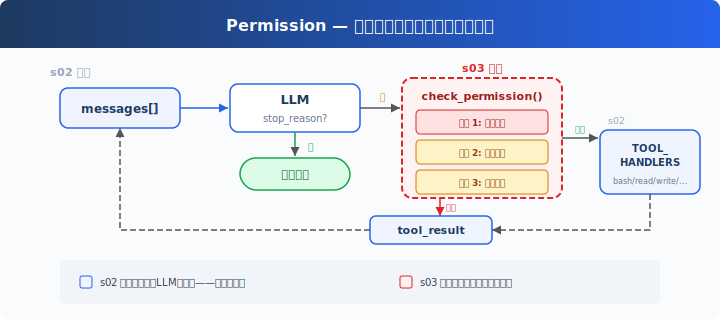

# s04: Permission -- 把 Tool 调用变成可控执行

[中文](README.md) · [English](README.en.md) · [日本語](README.ja.md)

[s03](../s03_tool_use/) → `s04` → [s05](../s05_hooks/) → ... → s21

> s03 让 Agent 有了多种 Tool；s04 决定这些 Tool 什么时候可以真的执行。

## 这一章解决什么

### 从 s03 继承下来的能力

s03 已经把一个万能 `bash` 拆成多个专用 Tool：

- `read_file` 读文件。
- `write_file` 写文件。
- `edit_file` 修改文件。
- `glob` 查找文件。
- `bash` 仍然保留，用来处理专用 Tool 覆盖不到的 shell 任务。

这些 Tool 都通过同一个 Agent Loop 流转：模型返回 `tool_use`，Harness 按 Tool 名称 dispatch 到 handler，执行后把 `tool_result` 放回 `messages[]`。

### s03 留下的风险

Tool 越清晰，Agent 越容易行动；但这也带来新的产品问题：**行动不应该等于自动放行**。

用户说“清理项目”时，模型可能选择运行删除命令；用户说“帮我部署一下”时，模型可能触发线上操作；用户说“把配置写到系统目录”，模型可能尝试写到工作区之外。即使模型没有恶意，它也可能误判任务边界。

只靠 System Prompt 写一句“不要做危险操作”不够，因为 System Prompt 仍然是给模型看的指令。真正能阻止动作发生的，必须是 Harness 层的执行前判断。

### s04 的解决方案

s04 在 handler 执行前插入 Permission gate：

```text
模型返回 tool_use
  → Harness 读取 Tool 名称和参数
  → Permission 判断
      拒绝：写回 Permission denied 的 tool_result
      询问：等待用户确认
      允许：真正调用 Tool handler
  → tool_result 回到 messages[]
  → 模型继续判断
```



这一章的重点不是“列出所有危险命令”，而是看懂一个产品边界：模型可以提出动作请求，但是否执行，由 Harness 决定。

## 这一章你要练会什么

- 看懂权限检查插在 Tool handler 执行之前。
- 区分硬拒绝、规则命中、用户确认三类处理。
- 理解被拒绝的动作也要作为 `tool_result` 回到 `messages[]`。
- 能从 PM 视角判断哪些动作应该自动放行，哪些必须询问，哪些应该直接禁止。
- 理解权限系统为什么属于 Harness，而不是模型自觉。

## 核心概念（先看词，再看代码）

| 概念 | PM 视角解释 |
|------|-------------|
| Permission | Tool 真正执行前的决策层。 |
| deny list | 永远不允许执行的动作，例如系统级删除、重启、格式化磁盘。 |
| ask rule | 不一定禁止，但需要用户确认的动作，例如删除、写系统目录、下载执行脚本。 |
| allow | 权限检查通过后，Harness 才会调用真正的 Tool handler。 |
| Harness | 权限判断的执行者。模型负责请求动作，Harness 负责决定动作能不能发生。 |

## 三道权限门

教学版用三道门解释 Permission pipeline：


### 第一道门：硬拒绝

硬拒绝用于处理“无论用户怎么说，教学 demo 都不该执行”的动作。例如 `sudo`、`shutdown`、`rm -rf /`。

```python
DENY_LIST = ["rm -rf /", "sudo", "shutdown", "reboot", "mkfs", "dd if=", "> /dev/sda"]


def check_deny_list(command: str) -> Optional[str]:
    for pattern in DENY_LIST:
        if pattern in command:
            return f"Blocked: '{pattern}' is on the deny list."
    return None
```

逐行读：

| 代码 | 这一行在做什么 |
|------|----------------|
| `DENY_LIST = [...]` | 定义一组永远不允许的命令片段。教学版用字符串匹配演示概念。 |
| `def check_deny_list(command: str) -> Optional[str]:` | 定义检查函数。传入 shell 命令，返回拦截原因或 `None`。 |
| `for pattern in DENY_LIST:` | 逐个查看 deny list 里的危险片段。 |
| `if pattern in command:` | 如果命令中出现这个片段，就命中硬拒绝。 |
| `return f"Blocked: ..."` | 返回拦截原因。调用方看到有原因，就不会执行 Tool。 |
| `return None` | 没有命中硬拒绝，交给后续规则继续判断。 |

这里要注意：字符串 deny list 只是教学演示，不是生产级安全方案。真实系统需要命令解析、参数校验、路径规范化、策略来源合并和审计。

### 第二道门：规则命中

有些动作不是永远禁止，但需要停下来问用户。例如写入工作区外路径、删除文件、给系统目录重定向输出。

```python
DESTRUCTIVE_COMMAND_HINTS = ["rm ", "mv ", "chmod 777", "> /etc/", "curl ", "wget "]


def check_rules(tool_name: str, tool_input: dict[str, Any]) -> Optional[str]:
    if tool_name in ("write_file", "edit_file"):
        path = str(tool_input.get("path", ""))
        if path_escapes_workspace(path):
            return f"Writing outside the workspace: {path}"

    if tool_name == "bash":
        command = str(tool_input.get("command", ""))
        if any(hint in command for hint in DESTRUCTIVE_COMMAND_HINTS):
            return f"Potentially destructive shell command: {command}"

    return None
```

逐行读：

| 代码 | 这一行在做什么 |
|------|----------------|
| `DESTRUCTIVE_COMMAND_HINTS = [...]` | 定义一组需要用户确认的命令线索。 |
| `def check_rules(...):` | 定义规则检查函数。它看 Tool 名称和 Tool 参数。 |
| `if tool_name in ("write_file", "edit_file"):` | 写文件和改文件都需要检查路径范围。 |
| `path = str(tool_input.get("path", ""))` | 从模型给的参数里取出路径。 |
| `if path_escapes_workspace(path):` | 判断这个路径是否离开当前项目目录。 |
| `return f"Writing outside..."` | 如果越界，就返回需要确认的原因。 |
| `if tool_name == "bash":` | bash 能力太宽，需要额外检查命令文本。 |
| `command = str(tool_input.get("command", ""))` | 从参数里取出 shell 命令。 |
| `if any(hint in command ...):` | 只要命令里出现一个高风险线索，就命中规则。 |
| `return f"Potentially destructive..."` | 返回需要确认的原因。 |
| `return None` | 没有命中规则，可以继续执行。 |

规则命中的含义不是“已经禁止”，而是“这一步需要用户做判断”。

### 第三道门：用户确认

规则命中后，Harness 暂停执行，把 Tool、参数和原因展示给用户。

```python
def ask_user(tool_name: str, tool_input: dict[str, Any], reason: str) -> str:
    print(f"\n\033[33m权限确认: {reason}\033[0m")
    print(f"工具: {tool_name}")
    print(f"参数: {tool_input}")
    choice = input("允许执行吗？[y/N] ").strip().lower()
    return "allow" if choice in ("y", "yes") else "deny"
```

逐行读：

| 代码 | 这一行在做什么 |
|------|----------------|
| `def ask_user(...):` | 定义用户确认函数。它只在规则命中时运行。 |
| `print(... reason ...)` | 告诉用户为什么这一步需要确认。 |
| `print(f"工具: {tool_name}")` | 显示模型想调用哪个 Tool。 |
| `print(f"参数: {tool_input}")` | 显示 Tool 参数，让用户知道影响范围。 |
| `choice = input(...).strip().lower()` | 等待用户输入确认结果。 |
| `return "allow" if ... else "deny"` | 只有明确输入 `y` 或 `yes` 才允许；其他输入默认拒绝。 |

这个默认拒绝很重要：当用户没有明确同意时，风险动作不应该继续执行。

## Permission gate 怎么接入 Agent Loop

三道门会被串成一个函数：

```python
def check_permission(tool_name: str, tool_input: dict[str, Any]) -> tuple[bool, str]:
    if tool_name == "bash":
        reason = check_deny_list(str(tool_input.get("command", "")))
        if reason:
            return False, reason

    reason = check_rules(tool_name, tool_input)
    if reason:
        decision = ask_user(tool_name, tool_input, reason)
        if decision == "deny":
            return False, f"Permission denied by user: {reason}"

    return True, "Permission allowed."
```

逐行读：

| 代码 | 这一行在做什么 |
|------|----------------|
| `def check_permission(...):` | 定义统一的权限入口。主循环只需要调用这一个函数。 |
| `if tool_name == "bash":` | 只有 bash 命令需要走 deny list。 |
| `reason = check_deny_list(...)` | 先检查是否命中硬拒绝。 |
| `if reason:` | 只要有拦截原因，就不能继续执行。 |
| `return False, reason` | 返回“不允许”和原因。 |
| `reason = check_rules(...)` | 没有硬拒绝后，再检查是否命中 ask rule。 |
| `if reason:` | 命中规则后进入用户确认。 |
| `decision = ask_user(...)` | 暂停执行，等用户判断。 |
| `if decision == "deny":` | 用户拒绝时，Tool 不执行。 |
| `return False, ...` | 把拒绝原因交给主循环。 |
| `return True, "Permission allowed."` | 没有命中风险，或用户明确允许，就通过。 |

主循环里新增的关键位置在这里：

```python
for block in response.content:
    if block.type != "tool_use":
        continue

    tool_input = dict(block.input)
    allowed, reason = check_permission(block.name, tool_input)
    if not allowed:
        results.append({
            "type": "tool_result",
            "tool_use_id": block.id,
            "content": reason,
        })
        continue

    output = dispatch_tool(block.name, tool_input)
```

逐行读：

| 代码 | 这一行在做什么 |
|------|----------------|
| `for block in response.content:` | 遍历模型这一轮输出的每个内容块。 |
| `if block.type != "tool_use":` | 不是 Tool 请求的内容块不用执行。 |
| `continue` | 跳过普通文本，继续看下一块。 |
| `tool_input = dict(block.input)` | 把模型给的 Tool 参数转成普通字典。 |
| `allowed, reason = check_permission(...)` | 在真正执行前做权限判断。 |
| `if not allowed:` | 如果权限拒绝，就不能调用 handler。 |
| `results.append({...})` | 把拒绝原因包装成 `tool_result`。 |
| `"tool_use_id": block.id` | 标记这个结果对应哪一张 `tool_use` 任务单。 |
| `"content": reason` | 让模型下一轮看到为什么被拒绝。 |
| `continue` | 跳过执行，继续处理下一张任务单。 |
| `output = dispatch_tool(...)` | 只有权限通过后，才真正调用 Tool handler。 |

这里最重要的是顺序：**先检查权限，再执行 Tool**。

而且被拒绝后也要写回 `tool_result`。这样模型下一轮知道“不是工具坏了，而是权限不允许”，它可以解释原因、改用只读方式，或者让用户调整目标。

## s04 相比 s03 改了什么

| 位置 | s03：Tool Use | s04：Permission |
|------|---------------|-----------------|
| Tool 能力 | 多个专用 Tool + dispatch | 沿用 s03 的 Tool 和 dispatch |
| 执行前判断 | 基本直接执行 | 先经过 Permission gate |
| 高风险 bash | 简单危险命令保护 | deny list + ask rule |
| 越界写入 | handler 内部报错 | 执行前就能触发权限判断 |
| 被拒绝动作 | 没有统一语义 | 作为 `tool_result` 回到 `messages[]` |
| 产品意义 | Agent 会使用工具 | Agent 的行动进入可控流程 |

所以 s04 不是新增一个 Tool，而是在所有 Tool 和 handler 之间加了一层产品策略。

## 怎么用在真实工作流

真实产品里，权限不是工程补丁，而是用户信任的一部分。

常见分层可以这样设计：

- 自动放行：读取文件、搜索文件、查看状态、列目录。
- 需要确认：写文件、改文件、删除文件、安装依赖、访问外部网络、运行部署命令。
- 直接禁止：系统级删除、格式化磁盘、泄露密钥、绕过安全策略、向未知外部位置发送敏感数据。

权限提示本身也要产品化。用户应该能看到：哪个 Tool、哪些参数、为什么询问、可能影响什么范围。否则“确认”只是形式，用户并不能真正判断。

## 动手练习：输入什么、会看到什么

<div class="learning-card">

**本章练习任务**：分别尝试只读、安全写入、删除、越界写入。

**预期现象**：只读动作直接通过；当前目录内的普通写入通常通过；删除或系统路径写入会触发确认或被拒绝。

**为什么会这样**：Agent 的行动自由来自 Tool，产品可信度来自 Tool 执行前的权限门。

</div>

```sh
# 在项目根目录运行。每行命令前的 # 是说明，不需要复制；没有 # 的行才需要执行。
cd ~/learn-claude-code-main
source .venv/bin/activate
python3 s04_permission/code.py
```

### 实验一：只读动作

输入：

```text
读取 README.md 的前 20 行，并用三句话说明这个项目是什么。
```

你应该看到模型选择 `read_file` 或 `glob` 一类只读 Tool。这类动作通常不会触发确认，因为它只是观察当前工作区。

### 实验二：普通写入

输入：

```text
创建一个 test.txt，里面写一句 hello permission。
```

如果模型使用 `write_file` 写入当前项目目录，权限检查会通过，然后 handler 才真正写文件。

观察重点：即使这个动作会改变文件，它也不是系统级危险动作。教学版让它通过，是为了让你看到“权限策略可以分层”，不是所有写入都必须拦住。

### 实验三：删除动作

输入：

```text
删除当前目录里的 test.txt。
```

模型可能选择 bash，例如 `rm test.txt`。这会命中 `DESTRUCTIVE_COMMAND_HINTS`，程序会打印权限确认，等待你输入 `y` 或直接回车。

如果你回车或输入 `n`，Tool 不会执行，拒绝原因会作为 `tool_result` 回到模型。

### 实验四：越界写入

输入：

```text
尝试写一个文件到 /etc/something。
```

这会触发“写入工作区外”的规则。你可以观察两件事：

1. Harness 会在真正写入前发现路径越界。
2. 如果你不允许，模型下一轮会看到拒绝原因，而不是以为写入成功。

## 本章小结

s04 的核心是一句话：**模型可以请求动作，但 Harness 必须在执行前做权限判断。**

s01 让我们知道历史在 `messages[]` 里；s02 让模型能请求 Tool；s03 把 Tool 拆成可管理的专用能力；s04 在这些能力真正触碰文件系统和 shell 之前，加入了可解释、可拒绝、可确认的决策层。

这也是 Agent 产品从 demo 走向可信工具的第一道门。

## 给产品经理的判断标准

先用一个具体例子判断：让 Agent 修改网页草稿可以自动保存，但上线发布必须审批。

- 权限规则是否围绕真实业务风险，而不是只围绕代码实现细节。
- 用户确认是否展示 Tool、参数、原因和影响范围。
- 被拒绝后，Agent 是否能解释并提供低风险替代方案。
- 是否避免把危险能力藏在一个过宽的万能 Tool 里。
- 权限策略是否可以审计、配置，并随着团队成熟度调整。
- 是否明确区分“模型建议”与“Harness 执行”。

## 常见问题

**问题：为什么不能只靠 System Prompt 告诉模型不要做危险操作？**

因为 System Prompt 约束的是模型输出，不是执行环境。模型仍然可能误判、被用户绕过，或在复杂任务里生成高风险 Tool 调用。真正的权限边界必须在 Harness 层。

**问题：为什么被拒绝也要写成 `tool_result`？**

因为模型下一轮只能看到 `messages[]`。如果 Harness 只是悄悄不执行，模型不知道发生了什么；把拒绝原因作为 `tool_result` 回传后，模型才能继续解释、换方案或请求用户授权。

**问题：教学版 deny list 够安全吗？**

不够。它只是帮你理解权限插入点。生产系统需要结构化命令解析、Tool 级权限、路径规范化、用户/项目/企业策略合并、审计日志和更强的默认拒绝策略。

## 代码证据与工程读者附录

这一节给想看实现的人。新手可以先跳过；等你能说清楚本章机制解决什么产品问题，再回来读代码。

教学版把权限结果简化成 `(allowed, reason)`。真实系统通常会有更丰富的结果类型，例如 `allow`、`deny`、`ask`、`passthrough`，还会记录权限来源：用户配置、项目配置、企业策略、命令行参数、会话临时授权等。

真实 Agent 还会把权限和 Hook、审计、UI 展示、子 Agent 权限冒泡结合起来。比如子 Agent 想执行高风险动作时，权限请求不应该在子 Agent 里静默失败，而应该冒泡到父 Agent 或用户界面。

但无论生产系统多复杂，关键插入点都一样：Tool handler 执行前，必须有 Harness 层的权限判断。

## 下一章

s05 Hooks 会把权限检查从主循环里抽出来。你会看到如何在不污染 Agent Loop 的前提下扩展日志、权限、通知和收尾逻辑。

<!-- translation-sync: zh@v3, en@v1, ja@v1 -->
