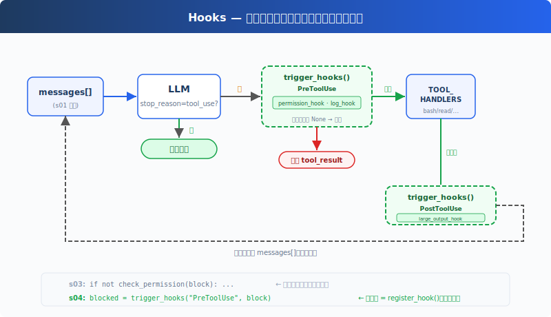

# s05: Hooks -- 让工作流扩展不挤进主循环

[中文](README.md) · [English](README.en.md) · [日本語](README.ja.md)

[s04](../s04_permission/) → `s05` → [s06](../s06_todo_write/) → ... → s21

> 稳定的 Agent Loop 负责流转，变化的产品策略挂到 Hook 上。

## 本页怎么学

<div class="learning-card">

1. **先记住 s04 的结论**：模型可以请求 Tool，但 Tool 是否执行，要先经过 Harness 的权限门。
2. **再看 s05 的新增问题**：权限、日志、通知、验收这些逻辑都围着 Tool 调用发生，但不能都塞进 `agent_loop()`。
3. **重点理解事件点**：Hook 不是另一套主循环，而是在固定时机触发的扩展函数。
4. **最后跑练习**：观察同一个主循环如何通过 Hook 完成日志、拦截和收尾。

</div>

## 这一章解决什么

### 从 s04 继承下来的能力

s04 已经把 Tool 执行变成可控流程：

- 模型返回 `tool_use`。
- Harness 读取 Tool 名称和参数。
- 权限门先判断是否允许。
- 允许后才分发到真正的 Tool handler。
- 执行结果或拒绝原因都会作为 `tool_result` 回到 `messages[]`。

这个流程让 Agent 不再“模型说执行就执行”。

### s04 留下的局限

权限只是围绕 Tool 调用的一种产品策略。真实 Agent 还会需要：

- 执行前记录审计日志。
- 执行前检查敏感信息或危险路径。
- 执行后检查格式、运行测试、同步状态。
- Agent 准备结束时确认任务是否真的完成。
- 用户输入进入模型前补充工作区、工单或团队上下文。

如果每加一个策略都直接改 `agent_loop()`，主循环会变成一团业务逻辑：既要管 LLM 调用，又要管 Tool 分发，还要管权限、日志、通知、验收。后面再加 Todo、Subagent、Skill、Memory 时会越来越难维护。

### s05 的解决方案

s05 引入 Hooks：在固定事件点触发扩展逻辑，让主循环保持稳定。



Hook 的关键不是“多写几个回调函数”，而是把责任边界拆开：

| 位置 | 主循环负责 | Hook 负责 |
|------|------------|-----------|
| 用户输入前后 | 把消息放进 `messages[]` | 注入环境、记录输入、做预处理 |
| Tool 执行前 | 发现 `tool_use`，准备执行 | 权限、日志、合规检查 |
| Tool 执行后 | 收集输出，写回 `tool_result` | 格式检查、通知、状态同步 |
| Agent 停止时 | 判断本轮不再需要 Tool | 收尾检查、统计、提醒未完成项 |

也就是说，Hook 不是把逻辑塞进主循环；恰恰相反，它是为了让主循环只保留稳定骨架。

## 这一章你要练会什么

- 理解 Hook 是 Harness 的扩展点，不是模型能力。
- 看懂 `PreToolUse` 为什么可以承接 s04 的权限检查。
- 区分“应该做成 Hook 的横切逻辑”和“应该做成 Tool 的业务能力”。
- 理解 Stop Hook 可以影响 Agent 是否继续，但必须有防止无限续跑的边界。

## 核心概念（先看词，再看代码）

| 概念 | PM 视角解释 |
|------|-------------|
| Hook | 某个事件发生时自动运行的扩展逻辑。 |
| event 事件 | Hook 的触发点，例如 `PreToolUse`、`PostToolUse`。 |
| callback 回调 | 被注册到某个事件上的函数。事件发生时 Harness 会调用它。 |
| `PreToolUse` | Tool 真正执行前，适合权限、日志、敏感检查。 |
| `PostToolUse` | Tool 执行后，适合检查结果、通知、同步副作用。 |
| `Stop` | Agent 准备结束时，适合验收、总结、提醒。 |

## Hook 注册表长什么样

教学版用一个很小的注册表保存 Hook：

```python
HOOKS = {
    "UserPromptSubmit": [],
    "PreToolUse": [],
    "PostToolUse": [],
    "Stop": [],
}

def register_hook(event: str, callback):
    HOOKS[event].append(callback)

def trigger_hooks(event: str, *args):
    for callback in HOOKS[event]:
        result = callback(*args)
        if result is not None:
            return result
    return None
```

逐行读：

| 代码 | 这一行在做什么 |
|------|----------------|
| `HOOKS = {...}` | 创建事件注册表。每个事件名对应一组 callback。 |
| `"PreToolUse": []` | Tool 执行前可以挂多个 Hook，例如权限和日志。 |
| `def register_hook(...)` | 提供注册入口，把某个 callback 挂到某个事件上。 |
| `HOOKS[event].append(callback)` | 真正把 callback 放进对应事件列表。 |
| `def trigger_hooks(...)` | 某个事件发生时，由 Harness 调用这个函数触发所有 callback。 |
| `for callback in HOOKS[event]:` | 按注册顺序执行这个事件上的 Hook。 |
| `result = callback(*args)` | 把事件相关数据传给 Hook，例如 Tool 任务单和执行结果。 |
| `if result is not None:` | 如果 Hook 返回了结果，表示它想影响后续流程。 |
| `return result` | 立即把这个结果交回主循环。教学版用它表达“拦截”。 |
| `return None` | 没有 Hook 拦截，主循环继续。 |

## Hooks 怎么接入 Agent Loop

s04 里主循环可能直接写：

```python
allowed, reason = check_permission(block.name, tool_input)
```

s05 改成触发事件：

```python
blocked = trigger_hooks("PreToolUse", block)
if blocked:
    results.append({
        "type": "tool_result",
        "tool_use_id": block.id,
        "content": str(blocked),
    })
    continue

output = TOOL_HANDLERS[block.name](**block.input)
trigger_hooks("PostToolUse", block, output)
```

逐行读：

| 代码 | 这一行在做什么 |
|------|----------------|
| `blocked = trigger_hooks("PreToolUse", block)` | Tool 执行前触发所有 `PreToolUse` Hook。 |
| `if blocked:` | 如果某个 Hook 返回拦截原因，就不能执行 Tool。 |
| `results.append({...})` | 把拦截原因包装成 `tool_result`。 |
| `"tool_use_id": block.id` | 保持 `tool_use` / `tool_result` 配对。 |
| `continue` | 跳过真正执行，继续处理下一张 Tool 任务单。 |
| `output = TOOL_HANDLERS[...]` | 没有被拦截时，才调用真正的 Tool handler。 |
| `trigger_hooks("PostToolUse", block, output)` | Tool 执行后触发后置 Hook。 |

这里最重要的变化是：`agent_loop()` 不再知道“权限检查函数叫什么、日志函数叫什么、通知函数叫什么”。它只知道在 Tool 前后触发事件。

新增一个执行前策略时，只需要：

```python
register_hook("PreToolUse", my_policy_hook)
```

主循环不用改。

## Hook 和 Tool 的区别

很多人第一次看到 Hook，会把它和 Tool 混在一起。可以这样判断：

| 问题 | 更适合 Tool | 更适合 Hook |
|------|-------------|-------------|
| 谁主动触发？ | 模型根据任务主动请求 | Harness 在固定事件点自动触发 |
| 面向谁？ | 面向模型的可用能力 | 面向产品运行时的扩展策略 |
| 例子 | 读文件、写文件、查任务、跑命令 | 权限、日志、通知、收尾检查 |
| 是否进入 `tool_use`？ | 是 | 否 |

如果这件事是用户任务本身的一部分，比如“读取文件”“创建任务”，它应该是 Tool。如果这件事围绕所有 Tool 调用都要发生，比如“执行前审计”“执行后通知”，它更像 Hook。

## 怎么用在真实工作流

Hook 适合承载横切流程：

- `UserPromptSubmit`：注入当前项目、工单、环境变量摘要。
- `PreToolUse`：权限审批、敏感信息检查、操作日志。
- `PostToolUse`：格式检查、测试触发、状态同步、通知。
- `Stop`：验收检查、提醒未完成 TODO、生成摘要。

PM 需要关注的是：Hook 不能变成隐形业务流程。任何会改变用户结果的 Hook，都要可见、可配置、可解释。尤其是权限类 Hook，必须保持在所有执行路径之前，不能被后续低优先级逻辑绕过。

## 动手练习：输入什么、会看到什么

<div class="learning-card">

**本章练习任务**：让 Agent 执行会触发前后处理的 Tool。

**预期现象**：你会看到 Tool 执行前后多出 `[HOOK]` 日志、拦截或收尾统计，而主循环结构不变。

**为什么会这样**：Hook 让产品策略挂在循环周围，避免每加一个策略就改核心代码。

</div>

```sh
# 在项目根目录运行。每行命令前的 # 是说明，不需要复制；没有 # 的行才需要执行。
cd ~/learn-claude-code-main
source .venv/bin/activate
python3 s05_hooks/code.py
```

练习 prompt（逐条输入，不要一次全贴）：

1. `读取 README.md 文件。`
2. `创建一个名为 test.txt 的文件。`
3. `删除 /tmp 里的所有临时文件。`

对照预期现象：

1. 每次 Tool 执行前是否出现 `[HOOK]` 日志。
2. 权限拒绝是否来自 Hook，而不是主循环硬编码。
3. Tool 执行后是否出现输出检查或统计。
4. Stop 时是否打印收尾信息。

## 本章小结

s05 没有改变 Agent Loop 的本质：仍然是模型返回 `tool_use`，Harness 执行 Tool，结果回到 `messages[]`。它改变的是扩展方式。

从这一章开始，主循环应该尽量稳定；变化快、跨多个 Tool 都要发生的产品策略，挂在 Hook 事件点上。

## 给产品经理的判断标准

先用一个具体例子判断：企业版 Agent 可以用 Hook 注入合规提示、记录审计日志、拦截敏感动作。

- 主循环是否仍然只负责 LLM 调用、Tool 执行和消息流转。
- Hook 的触发时机是否能被用户和团队理解。
- Hook 的副作用是否可审计，特别是写文件、发通知、提交代码。
- 权限类 Hook 是否不能被其它逻辑绕过。
- Stop Hook 是否有防止无限续跑的策略。

## 代码证据与工程读者附录

这一节给想看实现的人。新手可以先跳过；等你能说清楚本章机制解决什么产品问题，再回来读代码。

教学版只保留 4 个核心事件。生产系统里的 Hook 会更多，例如会话开始/结束、压缩前后、权限请求、子 Agent 开始/结束、文件变化等。

真实 HookResult 也不只是“None 或字符串”，通常会包含阻塞错误、权限决策、修改后的输入、附加 Context、是否阻止继续等字段。重要约束是：Hook 可以扩展流程，但不能破坏上层权限和安全策略。

## 下一章

s06 TodoWrite 会给 Agent 一个计划工具。复杂任务不应该一上来就执行，先把步骤列清楚，后续才更容易验收。

<!-- translation-sync: zh@v3, en@v0, ja@v0 -->
