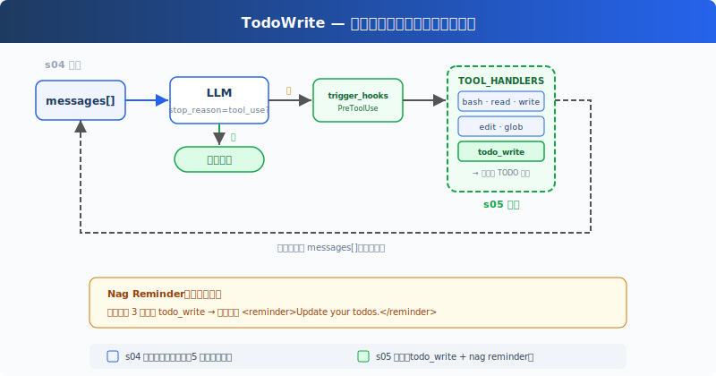

# s06: TodoWrite -- 让复杂任务先有计划再执行

[中文](README.md) · [English](README.en.md) · [日本語](README.ja.md)

[s05](../s05_hooks/) → `s06` → [s07](../s07_subagent/) → ... → s21

> 计划不是为了好看，而是为了让 Agent 不忘目标，也让用户看得见进度。

## 本页怎么学

<div class="learning-card">

1. **先记住 s05 的结论**：主循环保持稳定，横切策略可以挂到 Hook 上。
2. **再看本章新增什么**：`todo_write` 不是新执行能力，而是让计划进入 Agent 的工作流。
3. **重点看状态变化**：`pending → in_progress → completed` 让复杂任务有可见进度。
4. **最后跑练习**：观察 Agent 是否先列计划，再按计划推进和更新。

</div>

## 这一章解决什么

### 从 s05 继承下来的能力

到 s05 为止，我们已经有了一个可扩展的 Agent Harness：

- s02：模型可以请求 Tool，Harness 执行后把结果写回 `messages[]`。
- s03：Tool 被拆成有名称、参数和 handler 的专用能力。
- s04：Tool 执行前经过权限门。
- s05：权限、日志、收尾等横切策略可以通过 Hook 扩展。

这些能力让 Agent 可以执行动作，并且执行过程更可控。

### 现有机制留下的问题

复杂任务往往不是一步完成。比如：

```text
给所有 Python 文件补类型、跑测试、修失败，并总结改动。
```

如果 Agent 直接开始读文件、改文件、跑命令，它很容易被中途发现带偏：

- 读了很多文件后忘记最初目标。
- 修了第一个问题后忘记跑测试。
- 测试失败后开始追另一个方向，却没更新计划。
- 用户只能看到一串 Tool 调用，不知道任务做到哪一步。

这不是 Tool 不够强，而是缺少一个“当前任务清单”。

### s06 的解决方案

s06 增加 `todo_write` Tool。它不读文件、不写业务代码、不运行命令，只管理一份当前任务计划。



它的价值有三点：

| 价值 | 解释 |
|------|------|
| 让目标显性化 | 多步骤任务先拆开，避免一上来就乱执行。 |
| 让进度可见 | 用户能看到当前做哪一步、哪些还没做。 |
| 让偏离可纠正 | 发现新问题时，Agent 应该更新 TODO，而不是假装计划没变。 |

## 这一章你要练会什么

- 判断什么时候应该先写 TODO，而不是直接动手。
- 看懂 `todo_write` 只是计划 Tool，不是执行 Tool。
- 用 `pending`、`in_progress`、`completed` 理解任务进度。
- 区分轻量 TODO 和后面 s13 的完整 Task System。

## 核心概念（先看词，再看代码）

| 概念 | PM 视角解释 |
|------|-------------|
| `todo_write` | 一个只管理计划的 Tool，不直接改业务文件。 |
| `pending` | 还没开始做的步骤。 |
| `in_progress` | 当前正在做的步骤。教学版建议同时只有一个。 |
| `completed` | 已完成，并且最好有证据支持的步骤。 |
| reminder | Agent 长时间不更新计划时，Harness 可以提醒它。 |
| Context | TODO 会进入当前对话，帮助模型保持任务焦点。 |

## `todo_write` 保存了什么

核心实现是保存一个带状态的列表：

```python
CURRENT_TODOS: list[dict] = []

def run_todo_write(todos: list) -> str:
    global CURRENT_TODOS
    CURRENT_TODOS = todos

    lines = ["\n## Current Tasks"]
    for t in CURRENT_TODOS:
        icon = {"pending": " ", "in_progress": ">", "completed": "x"}[t["status"]]
        lines.append(f"  [{icon}] {t['content']}")
    print("\n".join(lines))
    return f"Updated {len(CURRENT_TODOS)} tasks"
```

逐行读：

| 代码 | 这一行在做什么 |
|------|----------------|
| `CURRENT_TODOS: list[dict] = []` | 在进程内保存当前 TODO 列表。教学版退出后会清空。 |
| `def run_todo_write(todos: list)` | 定义 Tool handler。模型调用 `todo_write` 时，Harness 会执行它。 |
| `global CURRENT_TODOS` | 声明下面要更新外层的当前 TODO 列表。 |
| `CURRENT_TODOS = todos` | 用模型提交的新计划替换旧计划。 |
| `lines = ["\n## Current Tasks"]` | 准备在终端显示当前任务列表。 |
| `for t in CURRENT_TODOS:` | 遍历每个任务项。 |
| `icon = ...` | 把状态转成简单符号：空格、`>`、`x`。 |
| `lines.append(...)` | 把任务内容和状态拼成一行。 |
| `print(...)` | 显示当前 TODO，让用户看见进度。 |
| `return f"Updated ..."` | 返回给模型的 `tool_result` 内容。 |

这段代码说明一件事：TODO 本身也是 Tool 结果的一部分。模型不是在脑子里悄悄列计划，而是通过 `tool_use` 显式更新计划。

## 它怎么接入 Tool 系统

`todo_write` 和 `read_file`、`write_file` 一样，通过分发表注册：

```python
TOOL_HANDLERS["todo_write"] = run_todo_write
```

主循环不用因为 TodoWrite 特别改造。模型返回：

```json
{
  "type": "tool_use",
  "name": "todo_write",
  "input": {
    "todos": [
      {"content": "检查相关文件", "status": "in_progress"},
      {"content": "应用代码修改", "status": "pending"},
      {"content": "运行测试", "status": "pending"}
    ]
  }
}
```

Harness 就按普通 Tool 流程执行 `run_todo_write()`，再把结果作为 `tool_result` 写回 `messages[]`。

所以 s06 没有改变 Agent Loop 的结构，只是给模型多了一个“管理计划”的工具。

## TODO 和真实任务系统的区别

TodoWrite 很轻，适合当前会话里的执行计划。它不是项目管理系统。

| 对比项 | TodoWrite | Task System（s13） |
|--------|-----------|--------------------|
| 生命周期 | 当前会话内 | 可持久化、跨会话 |
| 重点 | 当前怎么做 | 项目有哪些工作单元 |
| 结构 | 简单列表 | 状态、依赖、负责人、任务文件 |
| 适合场景 | 一个 Agent 正在完成一个复杂请求 | 多阶段项目、多 Agent 协作、可恢复任务图 |

先学 TodoWrite，是因为它能直接说明：**计划本身也应该被产品化，而不是只存在于模型临时输出里。**

## 怎么用在真实工作流

`todo_write` 适合以下场景：

- 多文件修改、迁移、测试修复、内容批量更新。
- 需要用户或 reviewer 看过程，而不只是看最终结果。
- 任务有明显阶段，例如调研、修改、验证、总结。

不要把 TODO 当作自动保证。它只是让计划显性化，仍需要验收标准、权限控制和结果验证。

## 动手练习：输入什么、会看到什么

<div class="learning-card">

**本章练习任务**：给 Agent 一个需要多步完成的小任务。

**预期现象**：你会看到它先写 TODO，再把任务状态从 `pending` 推进到 `in_progress` / `completed`。

**为什么会这样**：计划让复杂任务变得可见，用户能知道 Agent 在做哪一步。

</div>

```sh
# 在项目根目录运行。每行命令前的 # 是说明，不需要复制；没有 # 的行才需要执行。
cd ~/learn-claude-code-main
source .venv/bin/activate
python3 s06_todo_write/code.py
```

练习 prompt（逐条输入，不要一次全贴）：

1. `重构 s06_todo_write/example/hello.py：添加类型标注、docstring 和 main guard。`
2. `在 s06_todo_write/example/demo_pkg 下创建一个 Python 包，包含 __init__.py、utils.py 和 tests/test_utils.py。`
3. `检查 s06_todo_write/example 下的 Python 文件，并修复风格问题。`

对照预期现象：

1. 第一次 Tool 调用是否是 `todo_write`。
2. 计划是否覆盖主要步骤，而不是只有“完成任务”一句。
3. 执行过程中是否更新 `in_progress`。
4. 完成项是否有文件修改、测试结果或总结作为证据。

## 本章小结

s06 的核心不是“让模型写一份计划给用户看”，而是让计划成为 Harness 可观察的状态。计划一旦显性化，就能被提醒、被检查、被用户纠偏。

这为后面的 Subagent 和 Task System 做铺垫：先让单个 Agent 会管理当前步骤，再让它把子任务隔离出去，最后把项目任务持久化。

## 给产品经理的判断标准

先用一个具体例子判断：“重写落地页”应拆成审阅现状、改文案、检查移动端、总结风险，而不是一句话带过。

- 复杂任务开始前是否有清晰计划。
- TODO 粒度是否可执行，避免“完成项目”这种空泛步骤。
- 每个完成项是否有可观察证据，例如文件修改、测试结果、摘要。
- Agent 偏离计划时是否会更新计划，而不是假装仍在执行旧计划。
- 用户是否能从 TODO 判断任务进度和剩余风险。

## 代码证据与工程读者附录

这一节给想看实现的人。新手可以先跳过；等你能说清楚本章机制解决什么产品问题，再回来读代码。

教学版的 TODO 存在进程内存里，退出后清空。真实产品通常需要持久化、并发锁、依赖关系、负责人、任务事件和 Hook。

Claude Code 中既有简单的 TodoWrite，也有更完整的 Task System。前者适合当前会话内的轻量计划，后者适合跨会话、可依赖、可并发的任务管理。

## 下一章

s07 Subagent 会把大任务拆给独立 Agent 执行。TODO 解决“步骤可见”，Subagent 解决“上下文隔离”。

<!-- translation-sync: zh@v3, en@v1, ja@v1 -->
