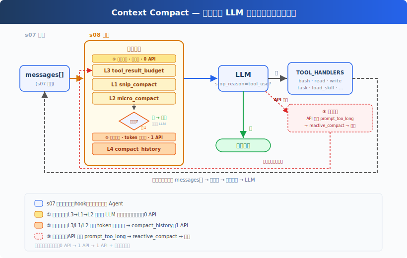
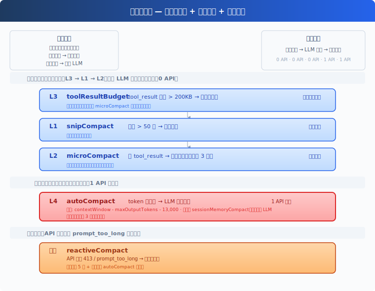
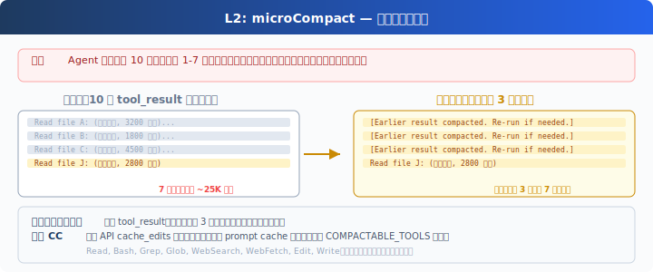
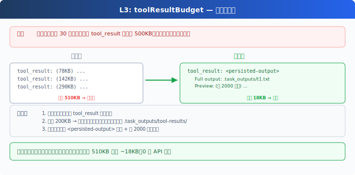
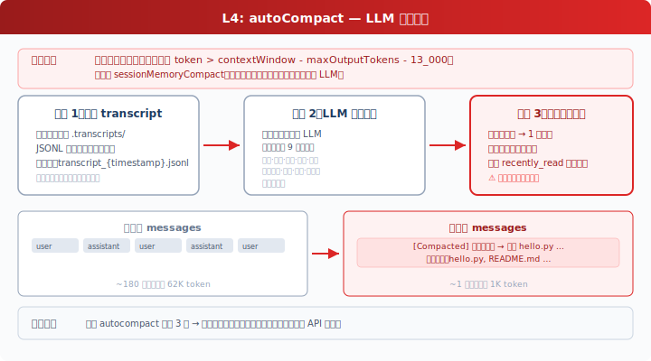

# s09: Context Compact -- 让长任务不被历史拖垮

[中文](README.md) · [English](README.en.md) · [日本語](README.ja.md)

[s08](../s08_skill_loading/) → `s09` → [s10](../s10_memory/) → ... → s21

> Context 会满。产品要设计“丢什么、留什么、怎么恢复”。

## 本页怎么学

<div class="learning-card">

1. **先记住 s08 的结论**：知识可以按需加载，避免一开始就把所有 Skill 塞进 Context。
2. **再看 s09 的新增问题**：即使按需加载，长任务仍会把 `messages[]` 撑大。
3. **重点理解四层压缩**：裁消息、压旧结果、大结果落盘、LLM 摘要分别解决不同问题。
4. **最后跑练习**：观察旧 Tool 结果如何被替换、落盘或总结。

</div>

## 这一章解决什么

### 从 s08 继承下来的能力

s08 解决的是“不要把还没用到的知识放进 Context”。技能目录常驻，完整 Skill 按需加载。

但按需加载只能减少不必要输入，不能解决所有历史膨胀。

### s08 留下的局限

Agent 连续工作一段时间后，`messages[]` 会堆满：

- 读过的文件内容。
- 命令输出和测试日志。
- 旧的 `tool_result`。
- 已经过时的 TODO。
- 中间探索和失败尝试。

上下文窗口有限。超过后 API 会拒绝请求，常见表现是 `prompt_too_long`。就算没有超过上限，太长的历史也会稀释当前目标，让模型更难抓住重点。

### s09 的解决方案

s09 加入 Context Compact：在调用模型前先整理历史，必要时用摘要替代旧内容；如果已经超限，再做 reactive compact 后重试。



压缩不是“随便删聊天记录”。它要回答三个问题：

| 问题 | 产品含义 |
|------|----------|
| 什么可以丢 | 过旧、低价值、可重新获取的信息。 |
| 什么必须留 | 当前目标、用户约束、最近操作、未完成事项、Tool 配对关系。 |
| 怎么恢复 | 大输出落盘、保留路径、必要时重新读取或查看 transcript。 |

## 这一章你要练会什么

- 理解为什么长任务必须管理 Context，而不是只扩大窗口。
- 区分裁消息、压旧结果、大结果落盘、LLM 摘要四类策略。
- 判断哪些信息可以丢、哪些必须保留、哪些需要可恢复。
- 看懂 reactive compact 如何应对已经发生的超限错误。

## 核心概念（先看词，再看代码）

| 概念 | PM 视角解释 |
|------|-------------|
| Context | 模型当前能看到的 System Prompt、`messages[]` 和 Tool 定义等输入。 |
| compact | 把历史变短，同时尽量保留继续任务所需信息。 |
| `tool_result` budget | 大 Tool 输出不能无限留在上下文。 |
| transcript 记录 | 完整历史可落盘保存，但不等于模型还能直接看到。 |
| reactive compact | API 已经报超限后触发的应急压缩。 |

## 四层压缩管线



教学版用了四层策略：

| 层级 | 做什么 | 解决的问题 |
|------|--------|------------|
| `tool_result_budget` | 单次大输出落盘，只在 Context 留预览和路径 | 防止一个大日志撑爆上下文 |
| `snip_compact` | 消息太多时裁掉中间旧消息 | 控制总消息数量 |
| `micro_compact` | 旧 `tool_result` 用占位符替换 | 保留“发生过什么”，减少原文 |
| `compact_history` | 用 LLM 总结完整历史 | 保留目标、约束、发现和剩余工作 |

执行顺序通常要先处理大 Tool 输出，再裁剪、微压缩，最后才做 LLM 摘要。原因是：大输出如果先被占位，就失去了落盘完整内容的机会。

## 压缩接在 Agent Loop 哪一层

核心伪代码：

```python
def agent_loop(messages):
    while True:
        messages[:] = tool_result_budget(messages)
        messages[:] = snip_compact(messages)
        messages[:] = micro_compact(messages)

        if estimate_token_count(messages) > THRESHOLD:
            messages[:] = compact_history(messages)

        try:
            response = client.messages.create(...)
        except PromptTooLongError:
            messages[:] = reactive_compact(messages)
            continue
```

逐行读：

| 代码 | 这一行在做什么 |
|------|----------------|
| `while True:` | Agent Loop 仍然持续运行。 |
| `tool_result_budget(messages)` | 先检查单次 Tool 输出是否太大，太大就落盘并留下预览。 |
| `snip_compact(messages)` | 再控制消息数量，裁掉中间旧消息。 |
| `micro_compact(messages)` | 把旧 Tool 结果替换成短占位符。 |
| `estimate_token_count(...)` | 粗略估算当前输入是否接近窗口上限。 |
| `compact_history(messages)` | 如果仍然太长，就用 LLM 生成结构化摘要。 |
| `client.messages.create(...)` | 整理完 Context 后再调用模型。 |
| `except PromptTooLongError` | 如果 API 仍然报超限，说明前面的估算不够或动态内容过长。 |
| `reactive_compact(messages)` | 做更激进的应急压缩。 |
| `continue` | 回到循环开头，用压缩后的历史重试。 |

这段代码说明：Compact 是 Harness 在调用模型前后的保护层。模型不会自己“整理上下文”；必须由 Harness 管理 `messages[]`。

## 三个典型压缩动作

### 旧结果占位



旧 `tool_result` 不一定要保留全文。可以替换成：

```text
[旧 Tool 结果已压缩：read_file README.md，原始内容可重新读取]
```

这样模型仍知道发生过这次 Tool 调用，但不会背着全部原文。

### 大结果落盘



测试日志、大文件、构建输出适合落盘。Context 里只留：

- 输出摘要。
- 前几行预览。
- 保存路径。
- 如需恢复，应如何重新读取。

### LLM 全量摘要



当简单裁剪已经不够时，用模型把历史总结成结构化状态：

- 当前目标。
- 用户明确约束。
- 已完成工作。
- 关键发现。
- 已修改文件。
- 未完成事项。
- 风险和待验证点。

摘要是有损的，所以要把“可恢复路径”也写进去。

## 怎么用在真实工作流

Context Compact 是产品连续性的基础：

- 调研型任务会产生大量旧读数，适合压缩旧 `tool_result`。
- 大日志、大文件、大测试输出要落盘并保留预览。
- 长任务压缩后，摘要必须包含当前目标、约束、已改内容、未完成事项。
- 用户应该能知道“发生了压缩”，避免误以为 Agent 仍保留全部细节。

压缩是有损的。不要承诺“无限记住所有细节”。要提供恢复路径，例如重新读取文件、查看 transcript、让用户补充关键约束。

## 动手练习：输入什么、会看到什么

<div class="learning-card">

**本章练习任务**：让 Agent 读取较多内容或执行多轮任务。

**预期现象**：你会看到旧 Tool 结果被压缩、摘要或裁剪，任务仍能继续。

**为什么会这样**：长任务一定会遇到 Context 限制，产品必须有整理历史的机制。

</div>

```sh
# 在项目根目录运行。每行命令前的 # 是说明，不需要复制；没有 # 的行才需要执行。
cd ~/learn-claude-code-main
source .venv/bin/activate
python3 s09_context_compact/code.py
```

练习 prompt（逐条输入，不要一次全贴）：

1. `读取 README.md，然后读取 s09_context_compact/code.py，再读取 s02_agent_loop/README.md`
2. `读取 s09_context_compact/ 目录下的所有文件`
3. 连续对话 20 轮以上，观察是否出现 `[auto compact]` 或 `[reactive compact]`

对照预期现象：

1. 旧 `tool_result` 是否被占位。
2. 大输出是否落盘。
3. 超过阈值时是否生成摘要。
4. 压缩后 Agent 是否还能说清当前任务。

## 本章小结

s09 的核心不是“把历史变短”这么简单，而是让长任务在有限 Context 里继续运行。

s08 解决“知识不要提前塞太多”；s09 解决“已经进入历史的内容怎么整理”。下一章 s10 会进一步区分：哪些信息不只是当前会话要保留，而是以后还会用到。

## 给产品经理的判断标准

先用一个具体例子判断：研究 Agent 连续读 20 篇资料时，需要保留结论和引用，而不是保留所有原文。

- 压缩是否优先处理低价值信息，而不是直接丢最近上下文。
- 大输出是否有可恢复路径，例如文件路径或重新读取方式。
- 摘要是否保留用户约束、当前目标和剩余工作。
- 压缩触发是否对用户可见。
- reactive compact 是否有重试上限，避免无限循环和费用失控。

## 代码证据与工程读者附录

这一节给想看实现的人。新手可以先跳过；等你能说清楚本章机制解决什么产品问题，再回来读代码。

教学版用字符数估算 token，用简单规则裁剪和占位。生产系统会有更精确的分词器、prompt cache 约束、读文件状态恢复、压缩失败熔断、压缩后恢复最近文件等机制。

真实执行顺序通常会先处理大 Tool 输出，再裁剪消息，再微压缩旧结果，最后才做 LLM 摘要。原因是：如果先把大输出替换成占位符，就失去了落盘完整内容的机会。

## 下一章

s10 Memory 会处理“压缩之后还要长期记住什么”。Compact 管当前会话能否继续，Memory 管跨压缩、跨会话的稳定知识。

<!-- translation-sync: zh@v3, en@v1, ja@v1 -->
