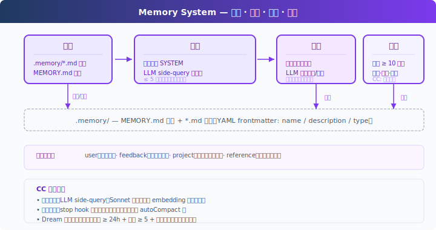

# s10: Memory -- 把长期偏好和项目事实留到下次

[中文](README.md) · [English](README.en.md) · [日本語](README.ja.md)

[s09](../s09_context_compact/) → `s10` → [s11](../s11_system_prompt/) → ... → s21

> Compact 管当前会话，Memory 管以后还会用到的知识。

## 本页怎么学

<div class="learning-card">

1. **先看上方机制演示**：不用记英文标签，先看箭头和状态变化。
2. **再读“这一章解决什么”**：确认它解决的是哪个产品问题。
3. **运行“动手练习”**：逐条输入 prompt，对照预期现象。
4. **最后看代码证据**：只看本章机制对应的关键代码，不需要从头背源码。

</div>

## 这一章解决什么

s08 的 Compact 会保留当前任务摘要，但压缩是有损的；新开会话时，摘要也不会自动存在。用户偏好、项目背景、常用入口、反复反馈，如果只放在 Context 里，迟早会丢。

这一章加入 Memory：把值得长期保留的信息写入文件系统，用索引常驻 System Prompt，相关内容按需加载回当前对话。


## 这一章你要练会什么

这里的“练会”不是靠阅读完成。建议你先看上方机制演示，再运行本章 demo，对照后面的预期现象检查自己是否理解。


- 区分短期 Context、压缩摘要和长期 Memory。
- 用 Markdown + frontmatter 保存可读、可审计的记忆。
- 让 Agent 在新一轮任务中按需加载相关记忆。
- 设计提取和整理机制，避免记忆无限堆积。

## 核心概念（先看词，再看代码）

遇到 Bash、Harness、dispatch、tool_use 这类词时，先把鼠标悬停在词上，看右侧解释。不要急着背代码，先理解它在产品里负责什么。


| 概念 | PM 视角解释 |
|------|-------------|
| Memory | 跨压缩、跨会话仍有价值的信息。 |
| `MEMORY.md` | 记忆索引，常驻 System Prompt。 |
| relevant memory | 与当前任务相关的记忆，按需注入。 |
| extraction | 每轮结束后判断是否有新偏好或项目事实要保存。 |
| consolidation | 定期去重、合并、清理过时记忆。 |



记忆文件示例：

```markdown
---
name: user-preference-tabs
description: User prefers tabs for indentation
type: user
---

User prefers using tabs, not spaces, for indentation.
**Why:** Consistency with existing codebase conventions.
**How to apply:** Always use tabs when writing or editing files.
```

四类记忆：

| 类型 | 适合保存 |
|------|----------|
| user | 用户稳定偏好，例如缩进、语言、沟通方式。 |
| feedback | 反复出现的工作反馈，例如不要 mock 数据库。 |
| project | 项目背景，例如某次重构的业务原因。 |
| reference | 常用入口，例如文档、工单、排查位置。 |

## 怎么用在真实工作流

Memory 适合保存“以后还会用到”的信息：

- 用户明确说“记住这个”。
- 多次反馈同一偏好。
- 项目里长期有效的约束。
- 重要系统入口、排查路径、命名约定。

不适合保存：

- 一次性任务细节。
- 临时猜测。
- 敏感信息、密钥、隐私数据。
- 已经过期或未经验证的结论。

## 动手练习：输入什么、会看到什么

<div class="learning-card">

**本章练习任务**：告诉 Agent 一个稳定偏好，再开启后续任务。

**预期现象**：你会看到偏好被提取为 Memory，并在后续对话中重新加载。

**为什么会这样**：Memory 不是保存全部聊天，而是保存长期有用的事实和偏好。

</div>


```sh
# 在项目根目录运行。每行命令前的 # 是说明，不需要复制；没有 # 的行才需要执行。
cd ~/learn-claude-code-main
python3 s10_memory/code.py
```

练习 prompt（逐条输入，不要一次全贴，分多轮输入）：

1. `I prefer using tabs for indentation, not spaces. Remember that.`
2. `Create a Python file called test.py`
3. `What did I tell you about my preferences?`
4. `I also prefer single quotes over double quotes for strings.`

对照预期现象：每轮结束后是否出现 `[Memory: extracted N new memories]`？`.memory/` 下是否生成 `.md` 文件？`MEMORY.md` 索引是否更新？新一轮对话是否加载了相关 Memory？

## 给产品经理的判断标准

先用一个具体例子判断：内容 Agent 可以记住“标题不要夸张”“默认用简体中文”“引用必须带来源”。


- Memory 是否只保存长期有价值的信息。
- 记忆内容是否可读、可删除、可审计。
- 用户是否知道 Agent 记住了什么。
- 相关记忆是否按需加载，而不是全部塞进每轮 Context。
- 是否有整理机制处理重复、冲突和过期信息。

## 代码证据与工程读者附录

这一节给想看实现的人。新手可以先跳过；等你能说清楚本章机制解决什么产品问题，再回来读代码。


教学版用 `.memory/` 本地目录、`MEMORY.md` 索引和 Markdown frontmatter。相关记忆选择先用 LLM side-query，失败时用关键词降级。提取发生在本轮结束后，整理用简单文件数阈值触发。

生产实现通常会更复杂：异步预取、防阻塞、文件锁、多会话门控、团队记忆、session memory、受限权限的提取子 Agent，以及更严格的注入预算。核心思想不变：索引常驻，内容按需，写入要克制，整理要低频。

## 下一章

s11 System Prompt 会把前面这些能力组装起来。随着 Tool、Skill、Memory 增多，System Prompt 不应继续写成一大段硬编码字符串。

<!-- translation-sync: zh@v2, en@v1, ja@v1 -->
