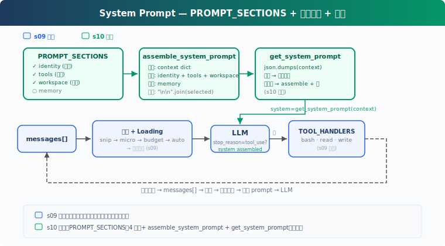

# s11: System Prompt -- 按运行状态组装 Agent 行为

[中文](README.md) · [English](README.en.md) · [日本語](README.ja.md)

[s10](../s10_memory/) → `s11` → [s12](../s12_error_recovery/) → ... → s21

> System Prompt 是运行时配置，不是一段越写越长的口号。

## 本页怎么学

<div class="learning-card">

1. **先看上方机制演示**：不用记英文标签，先看箭头和状态变化。
2. **再读“这一章解决什么”**：确认它解决的是哪个产品问题。
3. **运行“动手练习”**：逐条输入 prompt，对照预期现象。
4. **最后看代码证据**：只看本章机制对应的关键代码，不需要从头背源码。

</div>

## 这一章解决什么

从 s01 到 s09，Agent 增加了 Tool、Permission、Hooks、Todo、Subagent、Skill、Compact、Memory。如果 System Prompt 仍然是一大段硬编码字符串，每加一个能力都容易引入冲突，也难以按项目状态调整。

这一章把 System Prompt 拆成 sections，并在运行时根据真实状态组装：启用了哪些 Tool、当前工作区是什么、是否有 Memory。



## 这一章你要练会什么

这里的“练会”不是靠阅读完成。建议你先看上方机制演示，再运行本章 demo，对照后面的预期现象检查自己是否理解。


- 把 System Prompt 拆成可维护的模块。
- 根据运行时 Context 加载必要 section。
- 区分本地字符串缓存和 API 级 prompt cache。
- 判断哪些内容应该稳定常驻，哪些应该动态注入。

## 核心概念（先看词，再看代码）

遇到 Bash、Harness、dispatch、tool_use 这类词时，先把鼠标悬停在词上，看右侧解释。不要急着背代码，先理解它在产品里负责什么。


| 概念 | PM 视角解释 |
|------|-------------|
| System Prompt | Agent 的基础行为约束和能力说明。 |
| section | System Prompt 的独立段落，例如身份、工具、工作区、Memory。 |
| runtime assembly | 根据当前状态拼接 Prompt。 |
| prompt cache | 稳定内容可复用，动态内容要谨慎放置。 |
| Context | 组装 Prompt 时使用的真实运行状态。 |

分段定义：

```python
# 读法提示：先看函数名和数据流，再看细节。注释说明每段代码在 Harness 里负责什么。
PROMPT_SECTIONS = {
    "identity": "You are a coding agent. Act, don't explain.",
    "tools": "Available tools: bash, read_file, write_file.",
    "workspace": f"Working directory: {WORKDIR}",
    "memory": "Relevant memories are injected below when available.",
}
```

按需组装：

```python
# 读法提示：先看函数名和数据流，再看细节。注释说明每段代码在 Harness 里负责什么。
def assemble_system_prompt(context: dict) -> str:
    sections = [
        PROMPT_SECTIONS["identity"],
        PROMPT_SECTIONS["tools"],
        PROMPT_SECTIONS["workspace"],
    ]

    memories = context.get("memories", "")
    if memories:
        sections.append(f"Relevant memories:\n{memories}")

    return "\n\n".join(sections)
```

缓存组装结果：

```python
# 读法提示：先看函数名和数据流，再看细节。注释说明每段代码在 Harness 里负责什么。
def get_system_prompt(context: dict) -> str:
    global _last_context_key, _last_prompt
    key = json.dumps(context, sort_keys=True, ensure_ascii=False, default=str)
    if key == _last_context_key and _last_prompt:
        return _last_prompt
    _last_context_key = key
    _last_prompt = assemble_system_prompt(context)
    return _last_prompt
```

## 怎么用在真实工作流

System Prompt 组装适合产品化 Agent：

- 不同项目有不同工作目录、工具集合、记忆索引。
- 不同模式有不同指令，例如审查模式、执行模式、只读模式。
- 动态信息要尽量短，避免破坏缓存和稀释核心行为。
- Tool 的真实注册状态应驱动 Prompt，而不是靠手写描述猜测。

PM 需要把 System Prompt 当作产品配置面：哪些指令稳定、哪些可变、哪些由用户或团队策略控制。

## 动手练习：输入什么、会看到什么

<div class="learning-card">

**本章练习任务**：改变工作区、Memory 或可用 Tool 后再运行。

**预期现象**：你会看到 System Prompt 由不同 section 重新组装，而不是一段固定文本。

**为什么会这样**：Prompt 是产品运行状态的结果，应该由配置、能力和上下文共同生成。

</div>


```sh
# 在项目根目录运行。每行命令前的 # 是说明，不需要复制；没有 # 的行才需要执行。
cd ~/learn-claude-code-main
python3 s11_system_prompt/code.py
```

对照预期现象：

1. 输出中能看到哪些 section 被加载了，例如 `[assembled] sections: ...`。
2. 连续对话时是否显示 `[cache hit]`。
3. 创建 `.memory/MEMORY.md` 后，下一轮是否自动加载 memory section。

练习 prompt（逐条输入，不要一次全贴）：

1. `Read the file README.md`
2. `Create a file called .memory/MEMORY.md with content "- [test](test.md) — test memory"`
3. `Read the file code.py`

## 给产品经理的判断标准

先用一个具体例子判断：不同团队、项目、权限模式下，同一个 Agent 应看到不同的规则和工具说明。


- Prompt 是否按能力和状态分段，而不是一整段不可维护文本。
- 动态 section 是否基于真实状态加载，而不是关键词猜测。
- Tool 列表是否与实际注册 Tool 一致。
- Memory、Skill、工作区等动态信息是否控制长度。
- Prompt 修改是否能局部评估影响。

## 代码证据与工程读者附录

这一节给想看实现的人。新手可以先跳过；等你能说清楚本章机制解决什么产品问题，再回来读代码。


教学版的缓存只避免重复拼接字符串，不等同于 API prompt cache。生产系统通常会把稳定 section 和动态 section 分开，尽量让身份、基础规则、常驻工具说明命中缓存，而把 Memory、MCP 状态、环境信息等动态内容放在边界之后。

真实 Claude Code 的 System Prompt section 数量会随模式、工具、MCP、用户类型、输出风格和 feature flag 变化。还会区分 system context 与 user context，例如工作区信息、日期、CLAUDE.md、git 状态等。教学版只保留最小的分段和运行时组装模型。

## 下一章

s12 Error Recovery 会处理 Agent 运行中的常见失败：限流、网络错误、输出截断、上下文超限。能组装 Prompt 只是开始，能从失败中恢复才接近可用工作流。

<!-- translation-sync: zh@v2, en@v1, ja@v1 -->
