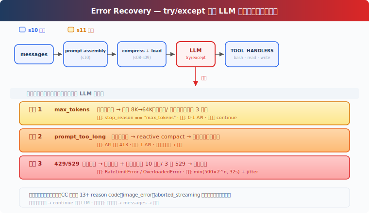

# s12: Error Recovery -- 让 Agent 遇到常见失败时可恢复

[中文](README.md) · [English](README.en.md) · [日本語](README.ja.md)

[s11](../s11_system_prompt/) → `s12` → [s13](../s13_task_system/) → ... → s21

> 错误恢复不是让 Agent 永远不失败，而是让 Harness 能识别常见失败，并选择合理的下一步。

## 本页怎么学

<div class="learning-card">

1. **先记住 s09-s11 的结论**：Context 会超限，Memory 会按需注入，System Prompt 会动态组装。
2. **再看 s12 的新增问题**：真实运行中会遇到截断、超限、限流、过载，不能让用户每次手动重问。
3. **重点理解恢复边界**：恢复逻辑在 Harness 层，有上限，不应绕过权限和 Tool 配对。
4. **最后跑练习**：观察长输出、Context 超限或瞬态故障时，系统如何续写、压缩或退避。

</div>

## 这一章解决什么

### 从 s11 继承下来的能力

s11 让 System Prompt 可以按运行状态组装。到这里，Agent 已经有了比较完整的运行时：

- Tool 和权限。
- Hook 和 TODO。
- Subagent 和 Skill。
- Compact 和 Memory。
- 动态 System Prompt。

这些能力让 Agent 更接近真实产品，但真实产品还必须面对失败。

### 现有机制留下的问题

调用模型时常见失败大致有三类：

| 失败 | 常见表现 | 如果没有恢复会怎样 |
|------|----------|--------------------|
| 输出被截断 | `stop_reason == "max_tokens"` | 结果说到一半，用户只能重新问 |
| Context 超限 | `prompt_too_long` | 请求直接失败，任务中断 |
| 瞬态故障 | 429 限流、529 过载、网络短暂失败 | 明明稍后可恢复，却直接报错 |

这些失败不一定说明用户需求错了，也不一定说明 Tool 坏了。很多时候只是运行时需要换策略。

### s12 的解决方案

s12 把错误恢复放进 Agent Loop：在 LLM 调用外面加 Harness 级处理，让 Agent 在有限范围内重试、压缩或续写。



核心原则：

- 失败要分类，不要都当成普通异常。
- 恢复要有上限，不能无限重试。
- 恢复不应重复执行有副作用的 Tool。
- 恢复不应绕过权限、Hook 和 `tool_use` / `tool_result` 配对。
- 用户应该看得见系统正在恢复什么。

## 这一章你要练会什么

- 识别 `max_tokens`、`prompt_too_long`、429/529 这类高频失败。
- 理解为什么 Harness 要管理重试、退避、Context 压缩和续写。
- 能判断一个 Agent 产品是否只是“能跑 demo”，还是具备基础恢复能力。
- 能向工程同事说明：错误恢复应在 Harness 层处理，而不是靠用户反复重新提问。

## 核心概念（先看词，再看代码）

| 概念 | PM 视角解释 |
|------|-------------|
| 输出截断 | 模型还没说完就触达输出 token 上限。 |
| Context 超限 | System Prompt、`messages[]`、Tool 定义等输入超过模型窗口。 |
| 瞬态故障 | 限流、过载、网络短暂失败，通常可稍后重试。 |
| backoff | 退避等待。失败次数越多，等待越久，避免立即打爆服务。 |
| 恢复状态 | 记录本轮已经尝试过哪些恢复动作，防止无限循环。 |

## 三条恢复路径

### 1. 输出被截断：提高上限或续写

如果模型因为 `max_tokens` 停下，说明它可能还没说完。常见处理是：

1. 第一次尝试提高 `max_tokens` 后重试。
2. 如果仍然不够，把已经生成的内容记入 `messages[]`。
3. 再追加一个“请从中断处继续”的用户侧提示。
4. 设置续写次数上限。

注意：续写只适合补全文本输出，不应该让系统重新执行已经执行过的 Tool。

### 2. Context 超限：reactive compact 后重试

s09 已经有主动压缩，但估算可能不准，动态 Prompt 或 Tool 定义也可能把输入撑爆。

当 API 已经返回 `prompt_too_long` 时，Harness 做 reactive compact：

```text
捕获 prompt_too_long
  → 如果本轮还没做过 reactive compact
      → 压缩 messages[]
      → 重试模型调用
  → 如果已经压缩过仍失败
      → 清楚退出，告诉用户需要缩小任务或补充关键上下文
```

### 3. 瞬态故障：指数退避

429、529 或短暂网络错误通常不应该立刻宣告任务失败。可以做指数退避：

```text
第 1 次失败：等 0.5 秒左右
第 2 次失败：等 1 秒左右
第 3 次失败：等 2 秒左右
...
达到上限后失败退出
```

如果服务端返回 `Retry-After`，优先尊重服务端建议。退避还应该加一点随机抖动，避免大量请求同时重试。

## 恢复逻辑接在 Agent Loop 哪里

核心伪代码：

```python
while True:
    try:
        response = with_retry(lambda: client.messages.create(
            model=state.current_model,
            system=system,
            messages=messages,
            tools=TOOLS,
            max_tokens=max_tokens,
        ), state)
    except PromptTooLongError:
        if not state.has_attempted_reactive_compact:
            messages[:] = reactive_compact(messages)
            state.has_attempted_reactive_compact = True
            continue
        return

    if response.stop_reason == "max_tokens":
        if not state.has_escalated:
            max_tokens = 64000
            state.has_escalated = True
            continue
        messages.append({"role": "assistant", "content": response.content})
        messages.append({"role": "user", "content": CONTINUATION_PROMPT})
        continue

    messages.append({"role": "assistant", "content": response.content})
    if response.stop_reason != "tool_use":
        return
```

逐行读：

| 代码 | 这一行在做什么 |
|------|----------------|
| `with_retry(...)` | 把模型调用包进重试逻辑，处理限流、过载等瞬态故障。 |
| `except PromptTooLongError` | 专门捕获 Context 超限。 |
| `has_attempted_reactive_compact` | 记录是否已经做过应急压缩，防止无限压缩重试。 |
| `messages[:] = reactive_compact(...)` | 原地更新 `messages[]`，保留同一个历史对象。 |
| `continue` | 压缩后重新调用模型。 |
| `if response.stop_reason == "max_tokens"` | 判断是否输出被截断。 |
| `if not state.has_escalated` | 第一次截断时先尝试提高输出上限。 |
| `messages.append({"role": "assistant"...})` | 如果仍被截断，把已有输出记入历史。 |
| `messages.append({"role": "user"...})` | 追加续写提示，让模型从中断处继续。 |
| `if response.stop_reason != "tool_use"` | 没有请求 Tool，说明本轮可结束。 |

这里最重要的是：恢复逻辑包住的是模型调用，不是随便重跑整个任务。已经执行过的 Tool 不应该因为模型续写而重复执行。

## 怎么用在真实工作流

产品经理不需要设计每个异常码的代码实现，但需要定义恢复边界：

- 对用户可见的状态：正在重试、正在压缩 Context、需要用户缩小任务。
- 对任务的影响：重试是否会重复执行 Tool？是否会重复写文件？是否需要幂等设计？
- 对成本的影响：续写和大 token 输出会增加调用成本，不能无限循环。
- 对安全的影响：恢复策略不应绕过权限审批，也不应自动执行更高风险操作。

一个合理的 PM 需求描述可以是：当模型输出被截断时，系统最多尝试续写 3 次；当 Context 超限时，先压缩历史再重试一次；当服务过载时，最多退避重试 10 次，并在 UI 中显示可理解的状态。

## 动手练习：输入什么、会看到什么

<div class="learning-card">

**本章练习任务**：触发长输出、Context 过长或临时失败场景。

**预期现象**：你会看到 Harness 尝试续写、压缩或退避重试，而不是直接崩溃。

**为什么会这样**：可靠性不是“永不失败”，而是失败后能分类、恢复、有上限。

</div>

```sh
# 在项目根目录运行。每行命令前的 # 是说明，不需要复制；没有 # 的行才需要执行。
cd ~/learn-claude-code-main
source .venv/bin/activate
python3 s12_error_recovery/code.py
```

练习 prompt（逐条输入，不要一次全贴）：

1. `生成一段很长的 Python 示例代码，包含多个类、测试和使用说明。`
2. `连续读取多个目录下的 README 和 code.py，让 Context 变长。`
3. 如果遇到 429/529，观察日志中的退避等待时间是否逐步增加。

对照预期现象时，不要只看“永不报错”，而是：

1. 失败是否被分类。
2. 恢复是否有上限。
3. 最终失败时是否清楚退出。
4. 恢复过程中是否没有重复执行有副作用的 Tool。

## 本章小结

s12 把“失败后怎么办”变成 Harness 的显式职责。模型可以继续判断任务，但错误分类、重试、压缩、退避这些运行时行为应该由 Harness 管理。

它也承接了 s09-s11：Context 超限时用压缩恢复，Prompt 动态组装时要控制输入，Memory 注入也要考虑预算和失败边界。

## 给产品经理的判断标准

先用一个具体例子判断：报表 Agent 生成到一半被截断时，应自动续写并提示用户恢复状态。

- 好的错误恢复有明确上限，不会无限重试。
- 重试前要确认 Tool 是否可能产生副作用，尤其是写文件、部署、发消息。
- Context 压缩后可能丢细节，关键决策和用户约束要尽量保留。
- 备用模型可以提高可用性，但不应默认改变安全边界或能力承诺。
- 用户应该看到“系统在恢复什么”，而不是只看到长时间无响应。

## 代码证据与工程读者附录

这一节给想看实现的人。新手可以先跳过；等你能说清楚本章机制解决什么产品问题，再回来读代码。

教学版只实现三条主路径：`max_tokens` 升级与续写、`prompt_too_long` 后 reactive compact、429/529 指数退避。实际系统还会处理连接错误、流式中断、图片错误、Hook 阻断、最大轮次、token 预算续跑等更多状态。

退避可以使用 `min(500 * 2^attempt, 32000)` 毫秒，再加 0-25% 随机抖动；如果服务端返回 `Retry-After`，优先尊重服务端建议。关键点是：`tool_use` 和 `tool_result` 的配对语义不能被恢复逻辑打乱。

## 下一章

s13 Task System 会把大目标拆成可持久化、可依赖、可恢复的任务图。错误恢复解决“这一轮失败后怎么办”，任务系统解决“一个项目级目标如何跨轮次继续”。

<!-- translation-sync: zh@v3, en@v1, ja@v1 -->
