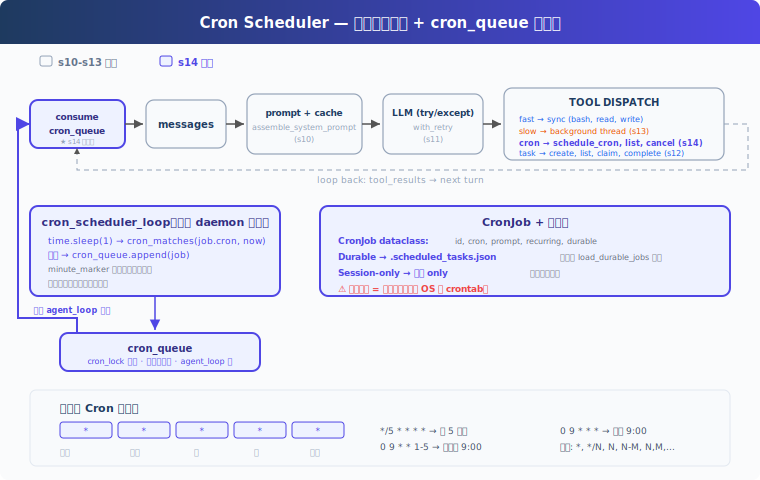

# s15: Cron Scheduler -- 让 Agent 按时间自动触发工作

[中文](README.md) · [English](README.en.md) · [日本語](README.ja.md)

[s14](../s14_background_tasks/) → `s15` → [s16](../s16_agent_teams/) → ... → s21

> 调度器负责“什么时候触发”，Agent loop 负责“触发后怎么做”。

## 本页怎么学

<div class="learning-card">

1. **先看上方机制演示**：不用记英文标签，先看箭头和状态变化。
2. **再读“这一章解决什么”**：确认它解决的是哪个产品问题。
3. **运行“动手练习”**：逐条输入 prompt，对照预期现象。
4. **最后看代码证据**：只看本章机制对应的关键代码，不需要从头背源码。

</div>

## 这一章解决什么

s13 让慢操作可以后台执行，但仍然需要用户手动触发。很多真实需求是定时的：每天早上检查 CI、每 30 分钟看一次服务状态、三分钟后提醒我回到任务。

本章加入 cron 调度：独立线程判断时间，到点后把 prompt 放入队列；Agent 空闲时消费队列并执行。



## 这一章你要练会什么

这里的“练会”不是靠阅读完成。建议你先看上方机制演示，再运行本章 demo，对照后面的预期现象检查自己是否理解。


- 理解调度、队列、Agent 执行三者为什么要解耦。
- 能读懂五段式 cron 表达式。
- 区分 durable 任务和 session-only 任务。
- 能判断一个“自动提醒 / 自动检查”功能是否有可靠的触发边界。

## 核心概念（先看词，再看代码）

遇到 Bash、Harness、dispatch、tool_use 这类词时，先把鼠标悬停在词上，看右侧解释。不要急着背代码，先理解它在产品里负责什么。


**CronJob**：一个定时任务，包含 `id`、`cron`、`prompt`、`recurring`、`durable`。

**cron 表达式**：五段式时间规则：分钟、小时、日、月、星期。例如 `*/5 * * * *` 表示每 5 分钟。

**cron_queue**：调度线程只负责把已触发任务入队，不直接调用模型。

**Queue Processor**：当 Agent 空闲且队列有任务时，启动一轮 Agent 执行。

**durable**：任务定义写入 `.scheduled_tasks.json`，重启后可恢复。注意：进程关闭时调度器不会继续运行，durable 只表示定义保留。

## 怎么用在真实工作流

PM 可以把 cron 用在“轻量、周期性、可容忍延迟”的 Agent 工作里：

- 每天固定时间生成状态报告。
- 每隔几分钟检查部署或测试是否完成。
- 在一段时间后提醒用户继续处理某个任务。

不适合直接用进程内 cron 承诺强 SLA。如果需要应用关闭后仍然触发，应使用系统 crontab、systemd timer、云调度器或队列服务。

## 动手练习：输入什么、会看到什么

<div class="learning-card">

**本章练习任务**：创建一个几分钟后的提醒或定时任务。

**预期现象**：你会看到时间到后任务自动进入对话，而不是靠模型“记住”。

**为什么会这样**：未来事件必须由 Harness 调度，模型本身不会在后台计时。

</div>


```sh
# 在项目根目录运行。每行命令前的 # 是说明，不需要复制；没有 # 的行才需要执行。
cd ~/learn-claude-code-main
python3 s15_cron_scheduler/code.py
```

练习 prompt（逐条输入，不要一次全贴）：

1. `Schedule a task to print the current date every 2 minutes`
2. `List all cron jobs`
3. `Create a one-shot reminder in 1 minute to check the build status`
4. `Cancel the recurring job and verify with list_crons`

对照预期现象：不输入新 prompt 时，是否也出现 `[queue processor]` 并自动执行；durable job 是否写入 `.scheduled_tasks.json`；取消后是否不再触发。

## 给产品经理的判断标准

先用一个具体例子判断：运营 Agent 可以每天早上自动检查数据并生成日报草稿。


- 定时触发应和 Agent 执行解耦，避免调度线程直接做复杂工作。
- durable 不等于“离线也会执行”，要向用户讲清楚边界。
- cron 表达式需要校验，坏配置不能拖垮调度器。
- 重复触发要有去重逻辑，同一分钟不能反复入队。
- 对周期任务要考虑频率、成本和噪音，避免自动化过度打扰用户。

## 代码证据与工程读者附录

这一节给想看实现的人。新手可以先跳过；等你能说清楚本章机制解决什么产品问题，再回来读代码。


教学版有四层：

```text
Scheduler thread → cron_queue → Queue Processor → agent_loop
```

`cron_scheduler_loop()` 每秒检查一次所有 `CronJob`。命中时使用 date-aware minute marker 去重，然后把 job 放入 `cron_queue`。`queue_processor_loop()` 用 `agent_lock` 判断 Agent 是否空闲，空闲时启动一轮执行。`agent_loop` 只消费队列，不负责判断时间。

cron 匹配采用常见五段式语义：分钟、小时、月必须匹配；日和星期同时受约束时，任一匹配即可。教学版支持 `*`、`*/N`、`N`、`N-M`、`N,M`。

真实系统还需要处理 UI 阻塞、队列优先级、任务漂移、时区、错过触发后的补偿策略，以及多进程并发调度问题。

## 下一章

s15 Agent Teams → 一个 Agent 能定时工作了。下一章让多个 Agent 组成团队，通过收件箱协作。
