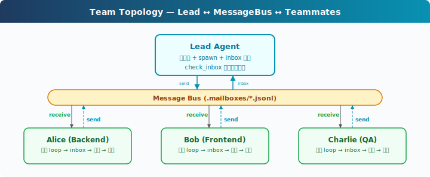

# s16: Agent Teams -- 让多个 Agent 分工协作

[中文](README.md) · [English](README.en.md) · [日本語](README.ja.md)

[s15](../s15_cron_scheduler/) → `s16` → [s17](../s17_team_protocols/) → ... → s21

> 单个 Agent 适合连续推进；Agent 团队适合并行处理相对独立的工作面。

## 本页怎么学

<div class="learning-card">

1. **先看上方机制演示**：不用记英文标签，先看箭头和状态变化。
2. **再读“这一章解决什么”**：确认它解决的是哪个产品问题。
3. **运行“动手练习”**：逐条输入 prompt，对照预期现象。
4. **最后看代码证据**：只看本章机制对应的关键代码，不需要从头背源码。

</div>

## 这一章解决什么

“重构整个后端”通常包含数据库、认证、API、测试、文档等多个工作面。一个 Agent 的 Context 和注意力有限，长时间单线推进容易遗漏上下文。

本章引入团队机制：Lead Agent 启动队友 Agent，队友在独立线程里工作，通过文件收件箱异步通信，结果再回到 Lead 的 `messages[]`。




## 这一章你要练会什么

这里的“练会”不是靠阅读完成。建议你先看上方机制演示，再运行本章 demo，对照后面的预期现象检查自己是否理解。


- 区分一次性 subagent 和持久队友。
- 理解 Agent 团队为什么需要 inbox，而不是只靠函数返回。
- 能设计 Lead、队友、消息和结果汇总的基本协作模式。
- 能判断多 Agent 是否真的提升效率，而不是制造协调成本。

## 核心概念（先看词，再看代码）

遇到 Bash、Harness、dispatch、tool_use 这类词时，先把鼠标悬停在词上，看右侧解释。不要急着背代码，先理解它在产品里负责什么。


**Lead Agent**：主 Agent，负责接收用户目标、启动队友、汇总结果和继续决策。

**Teammate Agent**：持久队友，有自己的 System Prompt、`messages[]` 和 Tool 子集。

**MessageBus**：教学版用 `.mailboxes/*.jsonl` 做收件箱。发送消息就是 append JSON 行，读取消息就是消费 inbox。

**inbox 注入**：队友发来的结果会被 Lead 读出，并作为用户侧消息注入历史，让模型能基于队友产出继续行动。

**一次性 subagent vs 队友**：一次性 subagent 做完即返回摘要；队友可以多轮工作、接收新消息、后续继续协作。

## 怎么用在真实工作流

PM 可以把团队模式用于“并行但边界清楚”的任务：

- 一个队友调查数据库结构，另一个队友检查 API 调用。
- 一个队友写实现，另一个队友写测试。
- 一个队友整理文档，Lead 负责最后合并判断。

不建议把强耦合、频繁互相修改同一文件的任务直接拆给多个 Agent。团队协作需要任务边界、通信规则和结果汇总机制，否则会放大混乱。

## 动手练习：输入什么、会看到什么

<div class="learning-card">

**本章练习任务**：启动两个队友处理不同任务。

**预期现象**：你会看到 Lead 和 teammate 通过消息总线异步沟通。

**为什么会这样**：多 Agent 协作需要独立上下文、角色边界和消息通道。

</div>


```sh
# 在项目根目录运行。每行命令前的 # 是说明，不需要复制；没有 # 的行才需要执行。
cd ~/learn-claude-code-main
python3 s16_agent_teams/code.py
```

练习 prompt（逐条输入，不要一次全贴）：

1. `Spawn alice as a backend developer. Ask her to create a file called schema.sql with a users table.`
2. `Check your inbox for alice's result.`
3. `Spawn bob as a tester. Ask him to check if schema.sql exists and list its contents.`

对照预期现象：Lead 是否能启动队友；`.mailboxes/` 中是否出现 JSONL 消息；队友完成后，Lead 的 inbox 是否把结果注入历史。

## 给产品经理的判断标准

先用一个具体例子判断：一个 Agent 写文案，另一个检查事实，Lead 汇总修改。


- 多 Agent 适合并行探索或分工，不适合所有任务。
- 每个队友的角色、输入、期望输出要清楚。
- 队友结果必须回到 Lead 的 Context，否则 Lead 无法决策。
- 权限请求应冒泡到 Lead 或用户，不能让队友独立越权。
- 团队协作的成本要低于并行带来的收益。

## 代码证据与工程读者附录

这一节给想看实现的人。新手可以先跳过；等你能说清楚本章机制解决什么产品问题，再回来读代码。


教学版的 `MessageBus` 用文件模拟异步收件箱：

```python
# 读法提示：先看函数名和数据流，再看细节。注释说明每段代码在 Harness 里负责什么。
BUS.send("alice", "lead", "Schema done", "result")
msgs = BUS.read_inbox("lead")
```

队友由 `spawn_teammate_thread()` 启动，每个队友有自己的 `messages[]`、System Prompt 和简化工具集：`bash`、`read_file`、`write_file`、`send_message`。Lead 每轮检查 inbox，把消息格式化后注入历史。

教学版没有实现完整文件锁和权限冒泡。真实系统应避免 read + unlink 的竞态，处理 permission request / response，并管理队友生命周期、颜色、状态、退出和失败恢复。

## 下一章

s16 Team Protocols → 有了队友和收件箱后，下一章定义结构化协议：关机、计划审批和 request/response。
