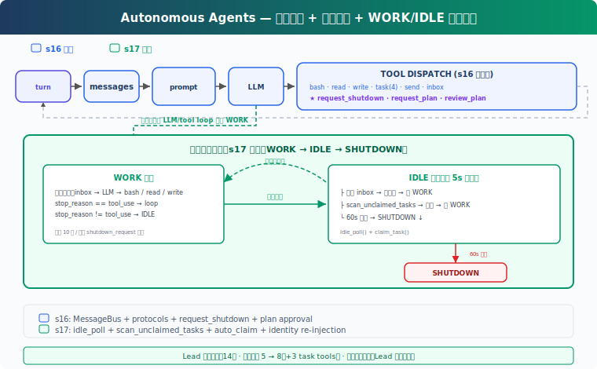

# s18: Autonomous Agents -- 队友自己发现并认领任务

[中文](README.md) · [English](README.en.md) · [日本語](README.ja.md)

[s17](../s17_team_protocols/) → `s18` → [s19](../s19_worktree_isolation/) → ... → s21

> Lead 负责定义任务和边界；空闲队友可以自己看板、认领、执行。

## 本页怎么学

<div class="learning-card">

1. **先看上方机制演示**：不用记英文标签，先看箭头和状态变化。
2. **再读“这一章解决什么”**：确认它解决的是哪个产品问题。
3. **运行“动手练习”**：逐条输入 prompt，对照预期现象。
4. **最后看代码证据**：只看本章机制对应的关键代码，不需要从头背源码。

</div>

## 这一章解决什么

s16 的队友能通信、能关机、能提交计划，但仍然需要 Lead 手动分配任务。如果任务板上有 10 个可做任务，Lead 不应该逐个 assign。

本章让队友在空闲时自动扫描任务板：发现 `pending`、无 `owner`、依赖已完成的任务，就尝试认领并开始工作。



## 这一章你要练会什么

这里的“练会”不是靠阅读完成。建议你先看上方机制演示，再运行本章 demo，对照后面的预期现象检查自己是否理解。


- 理解自治 Agent 不是“随便行动”，而是在明确任务板和协议内行动。
- 设计空闲轮询、自动认领和超时退出。
- 判断任务依赖是否会阻止错误认领。
- 区分 Lead 管目标与队友自组织执行。

## 核心概念（先看词，再看代码）

遇到 Bash、Harness、dispatch、tool_use 这类词时，先把鼠标悬停在词上，看右侧解释。不要急着背代码，先理解它在产品里负责什么。


**IDLE 阶段**：队友完成当前工作后不立即退出，而是定期检查 inbox 和任务板。

**scan_unclaimed_tasks**：扫描 `pending`、无 `owner`、`blockedBy` 全部完成的任务。

**自动认领**：队友调用 `claim_task`，成功后把任务放入自己的 Context 并回到 WORK 阶段。

**WORK → IDLE → SHUTDOWN**：队友的基本生命周期。无新任务超过一定时间后退出，收到 shutdown_request 时优先退出。

**身份重注入**：Context 被压缩后，队友需要重新看到自己的名字、角色和工作边界。

## 怎么用在真实工作流

PM 可以把自治队友用于“任务池明确、验收标准清楚”的工作：

- 批量修复 lint 或测试失败。
- 按模块补文档或测试。
- 多个独立页面或 API 的平行实现。

自治不等于放弃管理。Lead 仍然要定义任务、依赖、权限和退出条件。任务描述越模糊，自动认领越容易产生偏差。

## 动手练习：输入什么、会看到什么

<div class="learning-card">

**本章练习任务**：创建任务后让队友自己认领。

**预期现象**：你会看到队友轮询任务板、发现可做任务并 claim。

**为什么会这样**：自治不是放任模型自由发挥，而是让它在任务系统内行动。

</div>


```sh
# 在项目根目录运行。每行命令前的 # 是说明，不需要复制；没有 # 的行才需要执行。
cd ~/learn-claude-code-main
python3 s18_autonomous_agents/code.py
```

试试这个 prompt：

`Create 3 tasks on the board, then spawn alice and bob. Watch them auto-claim and work.`

对照预期现象：队友是否自动认领未分配任务；有 `blockedBy` 的任务是否等待前置完成；空闲超时后是否退出；IDLE 阶段收到 shutdown_request 是否立即响应；`.tasks/` 中的状态是否变化。

## 给产品经理的判断标准

先用一个具体例子判断：内容团队 Agent 可以自己认领“待改标题”“待补图”“待检查链接”。


- 自动认领必须基于任务状态和依赖，不应只看文本相似度。
- 任务粒度要适合单个队友独立完成。
- 队友要有空闲退出或 shutdown 协议，避免无限运行。
- 并发认领需要工程层保护，否则两个队友可能抢同一任务。
- 自治队友的结果必须回到 Lead，方便汇总和验收。

## 代码证据与工程读者附录

这一节给想看实现的人。新手可以先跳过；等你能说清楚本章机制解决什么产品问题，再回来读代码。


教学版的空闲轮询逻辑：

```python
# 读法提示：先看函数名和数据流，再看细节。注释说明每段代码在 Harness 里负责什么。
def idle_poll(agent_name, messages, name, role) -> str:
    for _ in range(IDLE_TIMEOUT // IDLE_POLL_INTERVAL):
        inbox = BUS.read_inbox(agent_name)
        if inbox:
            return "shutdown" or "work"

        unclaimed = scan_unclaimed_tasks()
        if unclaimed:
            result = claim_task(unclaimed[0]["id"], agent_name)
            if "Claimed" in result:
                messages.append(...)
                return "work"
    return "timeout"
```

`scan_unclaimed_tasks()` 的关键条件是：`status == "pending"`、没有 `owner`、`can_start(task_id)` 为真。教学版只有 owner 检查，没有文件锁；真实系统需要在 claim 时用文件锁或数据库事务完成读-检查-写，避免并发抢占。

队友外层循环在 WORK 和 IDLE 之间切换；WORK 阶段限制最大 LLM 轮数，IDLE 阶段优先处理 inbox，尤其是 shutdown_request。Lead 的 `consume_lead_inbox()` 同时负责协议响应和普通结果注入，避免消息被读走但状态没更新。

## 下一章

s18 Worktree Isolation → 队友能自己认领任务后，下一章让不同任务在不同目录里工作，减少互相覆盖。
