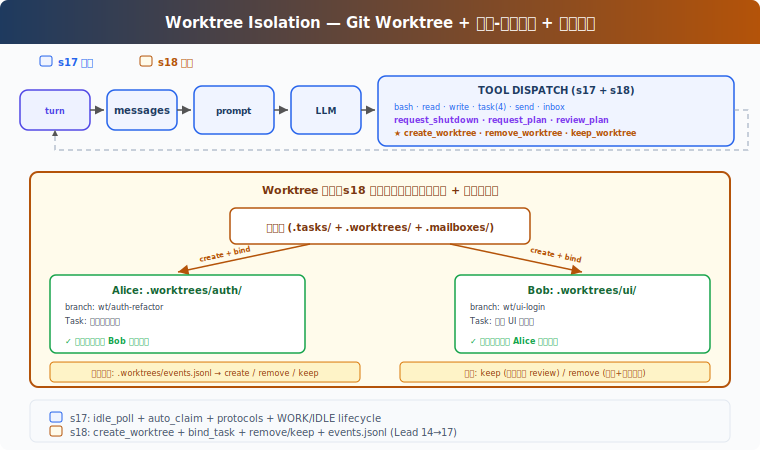

# s19: Worktree Isolation -- 让并行任务有独立工作区

[中文](README.md) · [English](README.en.md) · [日本語](README.ja.md)

[s18](../s18_autonomous_agents/) → `s19` → [s20](../s20_mcp_plugin/) → ... → s21

> 任务系统解决“谁做什么”；worktree 解决“在哪做”。

## 本页怎么学

<div class="learning-card">

1. **先看上方机制演示**：不用记英文标签，先看箭头和状态变化。
2. **再读“这一章解决什么”**：确认它解决的是哪个产品问题。
3. **运行“动手练习”**：逐条输入 prompt，对照预期现象。
4. **最后看代码证据**：只看本章机制对应的关键代码，不需要从头背源码。

</div>

## 这一章解决什么

s17 中，Alice 和 Bob 可以自动认领任务，但仍然在同一个目录里写文件。两个队友同时改 `config.py`，很容易互相覆盖，也很难回滚或审查。

本章把任务和 Git worktree 绑定：每个任务可以有独立目录和独立分支，队友认领任务后在对应 worktree 中执行 Tool。



## 这一章你要练会什么

这里的“练会”不是靠阅读完成。建议你先看上方机制演示，再运行本章 demo，对照后面的预期现象检查自己是否理解。


- 理解并行 Agent 为什么需要文件系统隔离。
- 用 worktree 把任务、目录和分支绑定起来。
- 判断什么时候应该保留 worktree 给人工 review，什么时候可以删除。
- 理解隔离不是权限系统，它主要防止工作区互相污染。

## 核心概念（先看词，再看代码）

遇到 Bash、Harness、dispatch、tool_use 这类词时，先把鼠标悬停在词上，看右侧解释。不要急着背代码，先理解它在产品里负责什么。


**Git worktree**：同一仓库的多个工作目录，每个目录可以在不同分支上工作。

**create_worktree**：为任务创建独立目录和分支。

**bind_task_to_worktree**：把任务记录中的 `worktree` 字段指向某个工作目录，不改变任务状态。

**cwd 切换**：队友认领带 worktree 的任务后，`bash`、`read_file`、`write_file` 在该目录下执行。

**keep / remove**：任务完成后，可以保留 worktree 给人工 review，也可以在确认无改动或允许丢弃时删除。

## 怎么用在真实工作流

PM 可以把 worktree 隔离用于并行开发或实验：

- 一个队友做认证重构，另一个队友做 UI 登录页。
- 多个方案同时探索，最后人工选择一个合并。
- 风险较高的改动先在独立分支完成，再 review。

worktree 不能自动解决冲突。它只是把冲突推迟到合并阶段，让每个 Agent 的改动更容易审查和回滚。

## 动手练习：输入什么、会看到什么

<div class="learning-card">

**本章练习任务**：给不同任务绑定不同 worktree。

**预期现象**：你会看到不同 Agent 在不同目录工作，减少文件冲突。

**为什么会这样**：并行协作不仅要隔离 Context，还要隔离文件系统。

</div>


```sh
# 在项目根目录运行。每行命令前的 # 是说明，不需要复制；没有 # 的行才需要执行。
cd ~/learn-claude-code-main
python3 s19_worktree_isolation/code.py
```

试试这个 prompt：

`Create two tasks, then create worktrees for each (bind with task_id). Spawn alice and bob. Watch them auto-claim and work in isolated directories.`

对照预期现象：两个 worktree 的 `git status` 是否显示不同分支；队友认领带 worktree 的任务后，bash 是否在对应目录执行；`remove_worktree` 对有改动的 worktree 是否默认拒绝；任务绑定后状态是否仍是 `pending`。

## 给产品经理的判断标准

先用一个具体例子判断：两个 Agent 同时改同一项目时，必须避免互相覆盖文件。


- 并行改同一代码库时，应优先考虑 worktree 或类似隔离机制。
- worktree 绑定不等于任务完成，任务状态仍要由 `complete_task` 更新。
- 有改动的 worktree 默认不应自动删除。
- 保留 worktree 可以让人工 review、测试和合并更清楚。
- 隔离目录不能替代权限、测试和代码审查。

## 代码证据与工程读者附录

这一节给想看实现的人。新手可以先跳过；等你能说清楚本章机制解决什么产品问题，再回来读代码。


教学版新增的核心函数：

```python
# 读法提示：先看函数名和数据流，再看细节。注释说明每段代码在 Harness 里负责什么。
create_worktree(name, task_id="")
bind_task_to_worktree(task_id, worktree_name)
remove_worktree(name, discard_changes=False)
keep_worktree(name)
validate_worktree_name(name)
```

`validate_worktree_name` 只允许 `[A-Za-z0-9._-]{1,64}`，防止路径穿越。`create_worktree` 成功执行 `git worktree add` 后才记录事件；`remove_worktree` 在有未提交改动或额外提交时默认拒绝，除非显式 `discard_changes=True`。

教学版把 `worktree` 字段写入 Task，这是为了便于学习。真实系统也可以把 worktree 状态作为独立 session 状态管理，再由 Agent 在 Context 中理解它和任务的关系。

## 下一章

s19 MCP Tools → 有了隔离的团队工作区后，下一章把外部工具通过 MCP 接进 Agent。
