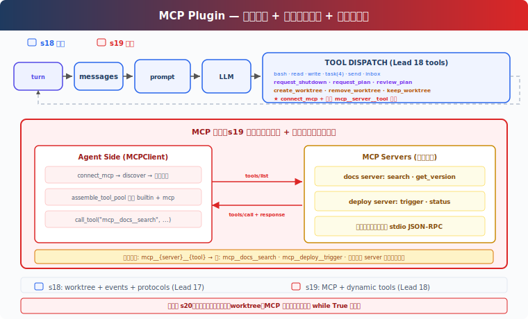

# s20: MCP Tools -- 用标准协议接入外部工具

[中文](README.md) · [English](README.en.md) · [日本語](README.ja.md)

[s19](../s19_worktree_isolation/) → `s20` → [s21](../s21_comprehensive/)

> MCP 让外部服务按统一方式暴露 Tool，Agent 不需要为每个系统重写接入层。

## 本页怎么学

<div class="learning-card">

1. **先看上方机制演示**：不用记英文标签，先看箭头和状态变化。
2. **再读“这一章解决什么”**：确认它解决的是哪个产品问题。
3. **运行“动手练习”**：逐条输入 prompt，对照预期现象。
4. **最后看代码证据**：只看本章机制对应的关键代码，不需要从头背源码。

</div>

## 这一章解决什么

前面章节里的 Tool 都是内置的：bash、read_file、write_file、任务、worktree。真实团队还会有 Jira、部署系统、Notion、内部知识库、数据平台等外部服务。

本章引入 MCP（Model Context Protocol）：外部服务实现标准的工具发现和调用接口，Harness 把它们组装进 Agent 的 Tool 池。



## 这一章你要练会什么

这里的“练会”不是靠阅读完成。建议你先看上方机制演示，再运行本章 demo，对照后面的预期现象检查自己是否理解。


- 理解 MCP Server、MCPClient、Tool discovery 和 Tool call。
- 看懂 `mcp__server__tool` 命名为什么重要。
- 判断 MCP 工具接入后，System Prompt 和 Tool 池为什么需要更新。
- 能从产品角度区分 readOnly 和 destructive 外部 Tool。

## 核心概念（先看词，再看代码）

遇到 Bash、Harness、dispatch、tool_use 这类词时，先把鼠标悬停在词上，看右侧解释。不要急着背代码，先理解它在产品里负责什么。


**MCP Server**：外部服务侧，实现工具列表和工具调用。

**MCPClient**：Agent Harness 侧，负责连接 server、发现工具、调用工具。

**Tool discovery**：连接后获取外部服务提供的 Tool 定义。

**`mcp__server__tool`**：MCP Tool 的命名空间格式，用于避免不同 server 的工具重名。

**assemble_tool_pool**：每轮把内置 Tool 和已连接 MCP Tool 组装给模型。

**readOnly / destructive**：工具风险标注。教学版只写进 description；真实产品应接入 permission 逻辑。

## 怎么用在真实工作流

PM 可以把 MCP 看成 Agent 的“外部能力市场”：

- 接入 docs server，让 Agent 搜索内部文档。
- 接入 deploy server，让 Agent 查看部署状态或触发部署。
- 接入 issue tracker，让 Agent 创建、查询、更新任务。

关键不是“接得越多越好”，而是每个 Tool 的权限、风险、返回格式和失败方式是否清楚。尤其是 destructive Tool，不应因为来自 MCP 就默认可执行。

## 动手练习：输入什么、会看到什么

<div class="learning-card">

**本章练习任务**：连接一个 mock MCP server 并调用它的工具。

**预期现象**：你会看到新的 mcp__server__tool 出现在 Tool 池里。

**为什么会这样**：MCP 把外部系统标准化接入 Agent Harness。

</div>


```sh
# 在项目根目录运行。每行命令前的 # 是说明，不需要复制；没有 # 的行才需要执行。
cd ~/learn-claude-code-main
python3 s20_mcp_plugin/code.py
```

练习 prompt（逐条输入，不要一次全贴）：

1. `Connect to the docs MCP server and search for something`
2. `Connect to the deploy server and trigger a deployment`
3. `Connect both servers — what tools are now available?`

对照预期现象：连接 MCP server 后，工具名是否带 `mcp__docs__` 或 `mcp__deploy__` 前缀；两个 server 的 Tool 是否同时可用；description 是否标注 `(readOnly)` 或 `(destructive)`。

## 给产品经理的判断标准

先用一个具体例子判断：企业 Agent 可以通过 MCP 接入知识库、工单系统、部署平台。


- 外部 Tool 要有清晰名称、描述、输入 schema 和风险等级。
- Tool 命名必须可区分来源，避免 `search`、`deploy` 这类重名冲突。
- 连接 MCP 后，Agent 下一轮才应看到新 Tool。
- destructive Tool 必须走 permission，不应只靠模型自觉。
- MCP 接入还要考虑认证、超时、错误提示和审计日志。

## 代码证据与工程读者附录

这一节给想看实现的人。新手可以先跳过；等你能说清楚本章机制解决什么产品问题，再回来读代码。


教学版用 mock server 模拟 MCP：

```python
# 读法提示：先看函数名和数据流，再看细节。注释说明每段代码在 Harness 里负责什么。
class MCPClient:
    def register(self, tool_defs, handlers):
        self.tools = tool_defs
        self._handlers = handlers

    def call_tool(self, tool_name: str, args: dict) -> str:
        return self._handlers[tool_name](**args)
```

`connect_mcp(name)` 创建 client、发现工具并保存到 `mcp_clients`。`assemble_tool_pool()` 每轮把内置工具和 MCP 工具合并，MCP 工具名规范化为 `mcp__{server}__{tool}`。名称中的非 `[a-zA-Z0-9_-]` 字符会替换为 `_`。

s19 去掉了 prompt cache，因为连接 MCP 后 Tool 池会动态变化。真实系统还需要处理 stdio、HTTP、SSE、WebSocket 等 transport，OAuth 认证、配置优先级、server 断连、工具调用超时、反向通知和 MCP Tool 权限。

## 下一章

s20 Comprehensive Agent → 前面 19 章每章只加一个机制。下一章把这些机制合回同一个 Harness。
